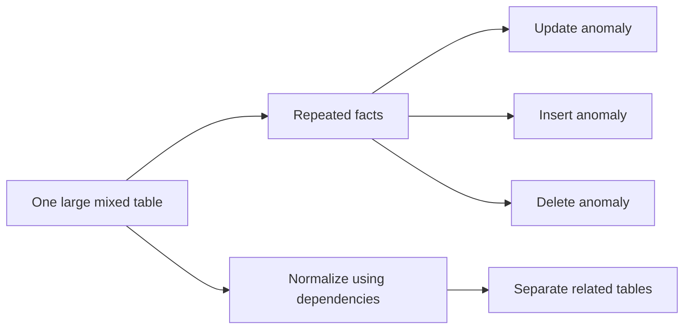
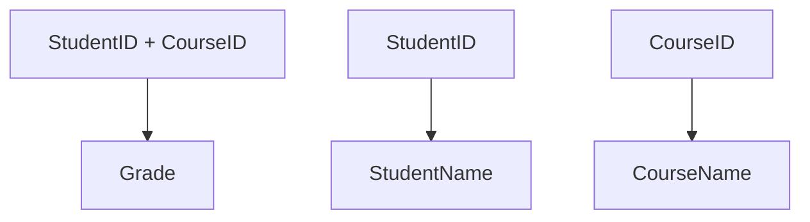
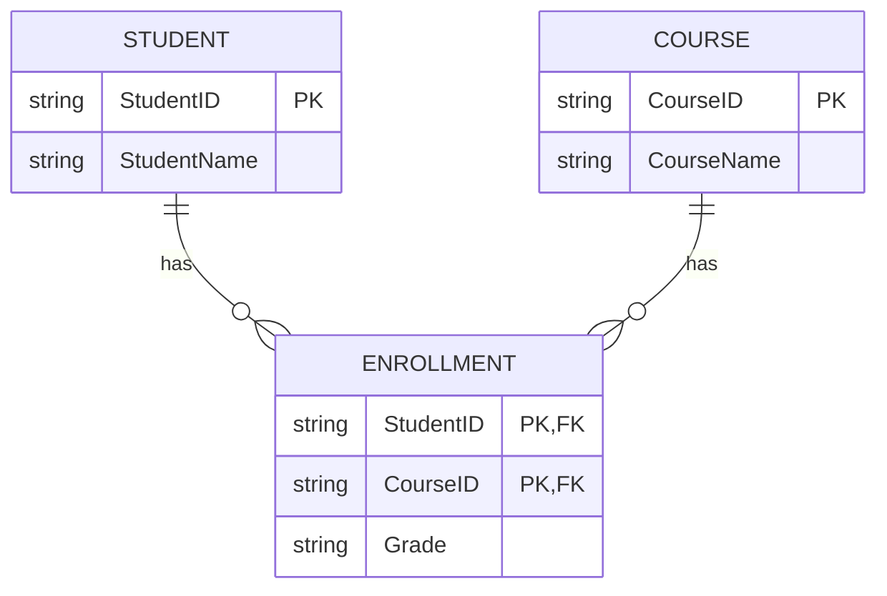
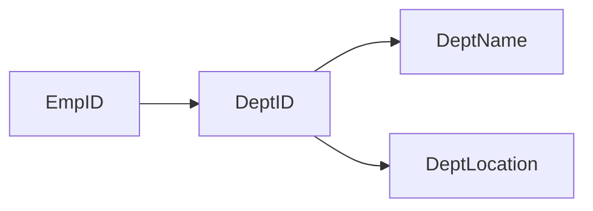
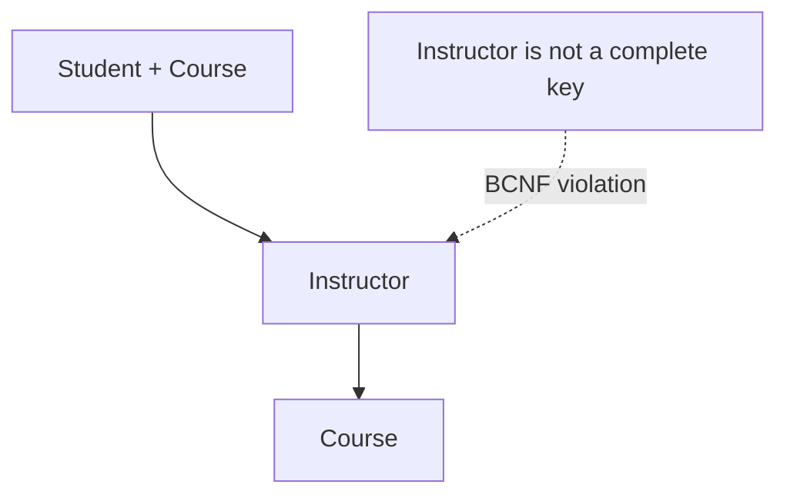
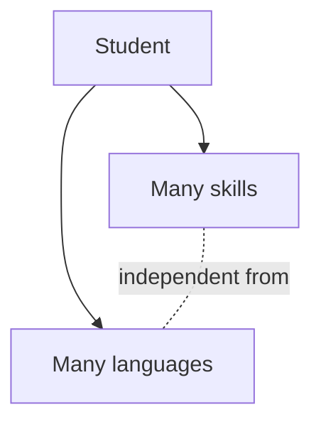
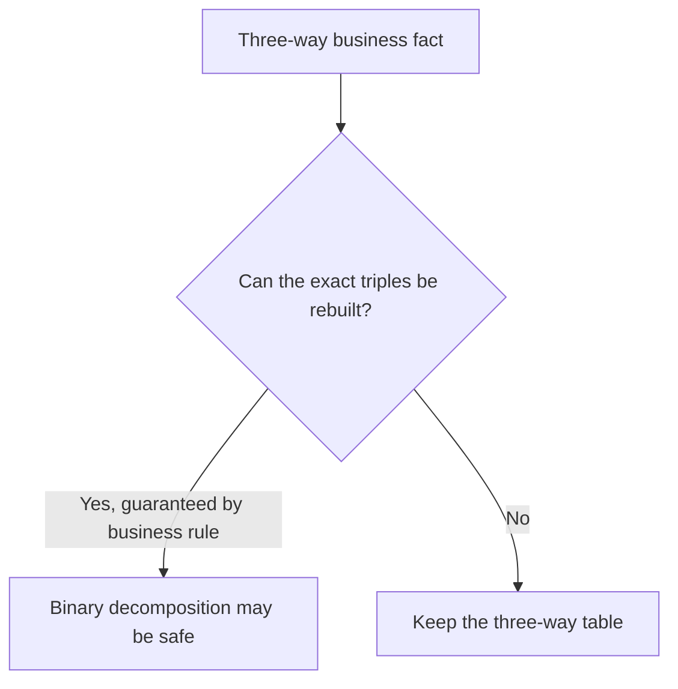
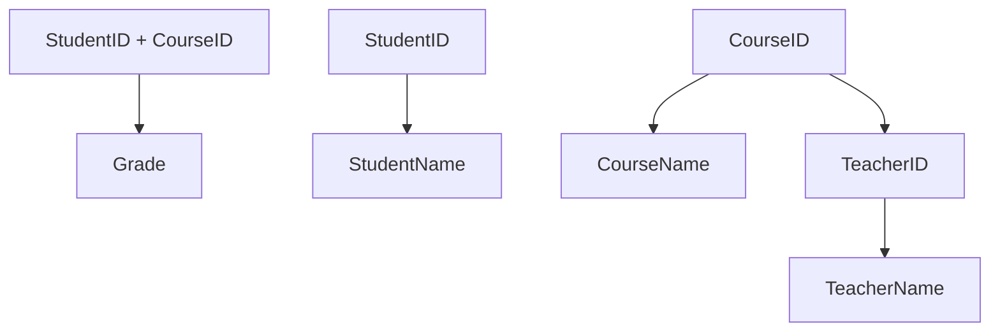
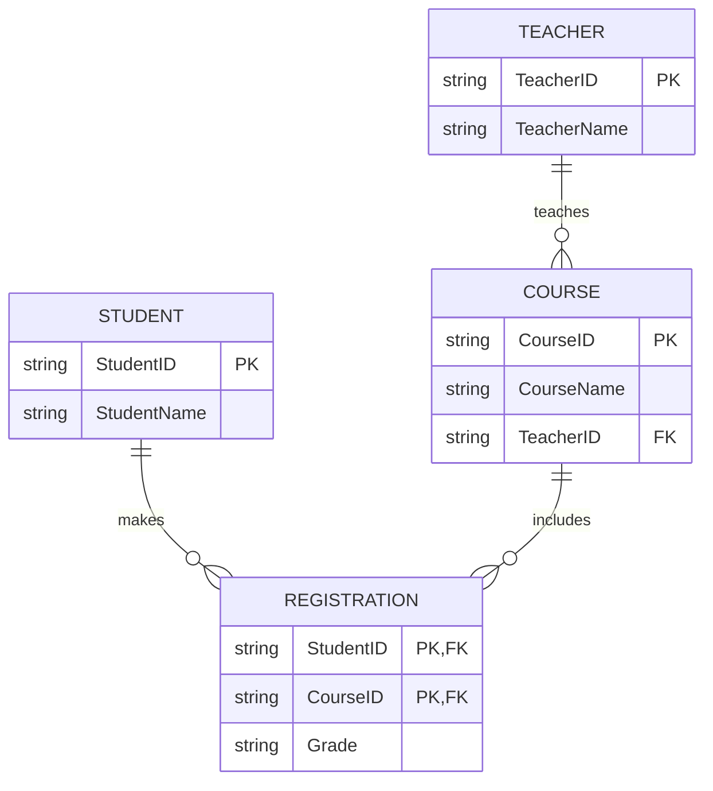
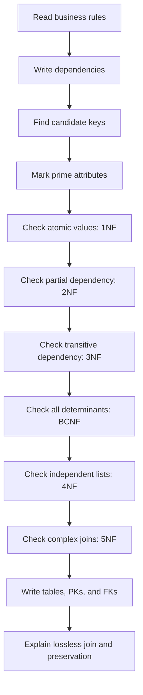

# DBMS Normalization — Expanded Visual Guide

> A simple but more comprehensive explanation of normalization, with theory, visual diagrams, solved problems, and interview-ready language.

This edition adds more theory to every normal form while keeping the explanation simple.

---

## 1. The central idea

Normalization is a method for arranging database information so that each fact is stored in the table where it naturally belongs.

Imagine a college database. It contains different facts:

- A student has a name and email.
- A course has a name and credits.
- A teacher teaches a course.
- A student receives a grade in a course.

If all these facts are put into one table, information gets repeated. Repetition creates inconsistency and maintenance problems.



### What normalization does

1. Finds what each column really describes.
2. Finds which columns determine other columns.
3. Separates facts that belong to different entities.
4. Connects the new tables with primary and foreign keys.
5. Tries to preserve the original information when tables are joined.

### What normalization does not mean

Normalization does not mean creating as many tables as possible. Too much splitting can make queries difficult and can increase joins. A good design separates facts that are genuinely independent while keeping related facts together.

---

## 2. Anomalies explained with one example

Consider:

| StudentID | StudentName | CourseID | CourseName | Teacher | Grade |
|---|---|---|---|---|---|
| S1 | Asha | C1 | DBMS | Rao | A |
| S1 | Asha | C2 | OS | Sen | B |
| S2 | Bilal | C1 | DBMS | Rao | A- |

### Update anomaly

If the name of `DBMS` changes, every row containing C1 must be updated. If one row is missed, the database contains two versions of the same fact.

### Insert anomaly

Suppose a new course C3 is created, but no student has enrolled yet. If the table requires a StudentID, the course cannot be stored independently.

### Delete anomaly

If S2 is the only student enrolled in C1 and that row is deleted, information about the DBMS course and teacher Rao may also disappear.

Normalization moves the facts into separate homes:


---

# 3. Theory foundation

## Relation and relation schema

A relation is a table. A relation schema describes its columns, for example:

```text
STUDENT(StudentID, StudentName, Email)
```

The actual rows are the current relation state. The schema is the design or structure.

## Domain

A domain is the set of valid values for a column.

Examples:

- `Age` may be a whole number from 0 to 150.
- `Grade` may be one of A, B, C, D, or F.
- `Status` may be Active or Inactive.

Domains support data quality, but a domain alone does not decide whether two columns depend on each other.

## Superkey, candidate key, and primary key

| Term | Simple explanation |
|---|---|
| Superkey | Any column or group of columns that identifies one row uniquely |
| Candidate key | A superkey with no unnecessary column |
| Primary key | The candidate key selected as the main identifier |
| Alternate key | A candidate key that was not selected as primary |
| Foreign key | A column that refers to a key in another table |
| Composite key | A key containing multiple columns |

Example:

```text
STUDENT(StudentID, Email, Name)
```

If both StudentID and Email are unique:

- Candidate keys: StudentID and Email.
- If StudentID is selected, it is the primary key.
- Email becomes an alternate key.
- StudentID + Name is only a superkey, not a candidate key, because Name is unnecessary.

## Prime and non-prime attributes

A prime attribute belongs to at least one candidate key. A non-prime attribute belongs to no candidate key.

For:

```text
ENROLLMENT(StudentID, CourseID, Grade)
```

with key `(StudentID, CourseID)`:

- Prime: StudentID, CourseID.
- Non-prime: Grade.

These terms are important for the formal definition of 3NF.

---

# 4. Functional dependencies

A functional dependency is a business rule about the data.

```text
StudentID -> StudentName
```

This means that one StudentID must always have one StudentName. If two rows have the same StudentID, they must have the same StudentName.

## Determinant and dependent

In `StudentID -> StudentName`:

- `StudentID` is the determinant.
- `StudentName` is the dependent attribute.

## Important warnings

### A functional dependency is not the same as correlation

If a small sample currently shows one name per city, that does not prove:

```text
City -> PersonName
```

The rule must be guaranteed by the real-world business meaning.

### The reverse dependency may not hold

Usually:

```text
StudentID -> StudentName
```

does not imply:

```text
StudentName -> StudentID
```

Two people may share a name.

## Types of dependencies

### Trivial dependency

A dependency is trivial when the right side is already part of the left side.

```text
(StudentID, CourseID) -> StudentID
```

This is always true and usually does not reveal a design problem.

### Non-trivial dependency

The right side is not already included in the left side.

```text
StudentID -> StudentName
```

### Full dependency

A column fully depends on a group of columns when the entire group is needed and no smaller part is enough.

Example:

```text
(StudentID, CourseID) -> Grade
```

A student can receive different grades in different courses, and a course has many students. Both columns are needed.

### Partial dependency

A column depends on only part of a composite key.

```text
StudentID -> StudentName
```

when the key is `(StudentID, CourseID)`.

2NF removes partial dependencies.

### Transitive dependency

A key determines one column, which determines another column.

```text
EmpID -> DeptID
DeptID -> DeptName
```

So department name reaches EmpID through DeptID. 3NF removes this kind of unnecessary chain for non-key attributes.

---

# 5. First Normal Form — 1NF

## Formal idea

A relation is in 1NF when its attributes contain values from suitable atomic domains and it has no repeating groups.

In simple language:

> One cell should represent one value, not a list of values.

Atomic does not always mean “impossible to split.” It means “one value for the needs of this database.” If an address is always treated as one uninterpreted label, one address value may be acceptable. If the application searches by city, street, or PIN code, separate columns are more useful.

## Examples

### List in a cell

Not 1NF:

| StudentID | Phones |
|---|---|
| S1 | 9876, 9123 |

Correct:

| StudentID | Phone |
|---|---|
| S1 | 9876 |
| S1 | 9123 |

### Repeating columns

Not 1NF:

```text
Student(StudentID, Name, Course1, Course2, Course3)
```

Correct:

```text
Student(StudentID, Name)
StudentCourse(StudentID, CourseID)
```


## Why 1NF matters

Without 1NF:

- Searching individual values is awkward.
- Updating one value inside a list is difficult.
- Counting and joining values becomes unreliable.
- A column has inconsistent meaning.

## Practice problem

`ORDER(OrderID, Customer, Products)` contains `Keyboard, Mouse` in one Products cell.

**Answer:** Not 1NF. Create `ORDER(OrderID, Customer)` and `ORDER_ITEM(OrderID, ProductID)`.

---

# 6. Second Normal Form — 2NF

## Formal idea

A relation is in 2NF when:

1. It is in 1NF.
2. No non-prime attribute depends on only a proper part of a candidate key.

## Simple idea

> If the key has two parts, every non-key detail must need both parts.

2NF is about partial dependency. It mainly matters when a candidate key is composite. If all candidate keys contain one attribute, a 1NF table is automatically in 2NF.

## Detailed example

```text
ENROLLMENT(StudentID, CourseID, StudentName, CourseName, Grade)
```

Key:

```text
(StudentID, CourseID)
```

Dependencies:

```text
StudentID -> StudentName
CourseID -> CourseName
(StudentID, CourseID) -> Grade
```



`StudentName` and `CourseName` do not need the whole key. That is a partial dependency.

## Decomposition

```text
STUDENT(StudentID, StudentName)
COURSE(CourseID, CourseName)
ENROLLMENT(StudentID, CourseID, Grade)
```



## What 2NF does not remove

2NF does not automatically remove transitive dependencies. A relation can be in 2NF and still fail 3NF.

## Practice problem

```text
ORDER_LINE(OrderID, ProductID, ProductName, Quantity)
```

Key: `(OrderID, ProductID)`.

Since `ProductID -> ProductName`, ProductName depends on only part of the key.

Correct design:

```text
PRODUCT(ProductID, ProductName)
ORDER_LINE(OrderID, ProductID, Quantity)
```

---

# 7. Third Normal Form — 3NF

## Formal idea

A relation is in 3NF if, for every non-trivial dependency `X -> A`:

- X is a superkey, or
- A is a prime attribute.

## Simple version

> A non-key detail should not depend on another non-key detail.

The common memory phrase is:

> The key, the whole key, and nothing but the key.

- 1NF gives identifiable rows.
- 2NF gives the whole key.
- 3NF removes dependencies through another non-key attribute.

## Detailed example

```text
EMPLOYEE(EmpID, EmpName, DeptID, DeptName, DeptLocation)
```

Rules:

```text
EmpID -> EmpName, DeptID
DeptID -> DeptName, DeptLocation
```



Department details belong to the department, not to each employee row.

## Decomposition

```text
EMPLOYEE(EmpID, EmpName, DeptID)
DEPARTMENT(DeptID, DeptName, DeptLocation)
```

## Why the result is safer

- A department is stored even when it has no employees.
- Department names are updated once.
- Deleting the last employee does not delete department information.

## Practice problem

```text
BOOK(BookID, Title, AuthorID, AuthorName)
```

Rules:

```text
BookID -> Title, AuthorID
AuthorID -> AuthorName
```

Correct design:

```text
BOOK(BookID, Title, AuthorID)
AUTHOR(AuthorID, AuthorName)
```

---

# 8. BCNF — Boyce-Codd Normal Form

## Formal idea

A relation is in BCNF if, for every non-trivial dependency `X -> Y`, X is a superkey.

## Simple idea

> Every determinant must be capable of identifying a complete row.

BCNF does not provide the special 3NF exception for a prime right-hand-side attribute.

## Why BCNF is needed

3NF can permit a dependency where the determinant is not a superkey if the dependent attribute is prime. That can still leave redundancy. BCNF removes this more aggressively.

## Example

```text
TEACH(Student, Course, Instructor)
```

Rules:

```text
(Student, Course) -> Instructor
Instructor -> Course
```

`Instructor` determines Course but is not enough to identify the Student. Therefore Instructor is not a superkey and BCNF fails.



## Decomposition

```text
INSTRUCTOR_COURSE(Instructor, Course)
STUDENT_INSTRUCTOR(Student, Instructor)
```

## 3NF versus BCNF

| Question | 3NF | BCNF |
|---|---|---|
| Must every determinant be a superkey? | Not always | Yes |
| Allows prime-attribute exception? | Yes | No |
| Is it weaker or stricter? | Weaker | Stricter |
| Can every BCNF relation be called 3NF? | Yes | Yes |
| Can every 3NF relation be called BCNF? | No | No |

## Important design trade-off

BCNF decomposition is lossless when performed correctly, but dependency preservation is not always guaranteed. 3NF synthesis is often chosen when preserving dependencies is more important.

## Practice problem

```text
R(A, B, C)
AB -> C
C -> B
```

Candidate keys can be `AB` and `AC`. All attributes are prime. `C -> B` can satisfy 3NF because B is prime, but C is not a superkey, so BCNF fails.

---

# 9. 4NF — Fourth Normal Form

## Formal idea

4NF deals with non-trivial multivalued dependencies. A relation is in 4NF if every non-trivial multivalued dependency has a superkey on its left side.

## Simple idea

> Do not store two independent many-valued lists in one table.

## Example

A student has many skills and many languages. Skills do not determine languages.

Bad design:

| Student | Skill | Language |
|---|---|---|
| Asha | Python | English |
| Asha | Python | Hindi |
| Asha | Linux | English |
| Asha | Linux | Hindi |

The combinations are produced because each skill is paired with each language.



## Decomposition

```text
STUDENT_SKILL(Student, Skill)
STUDENT_LANGUAGE(Student, Language)
```

## When should lists stay together?

If the two values describe one real relationship, they should stay together.

Example:

```text
STUDENT_LANGUAGE_LEVEL(Student, Language, Level)
```

Here the level belongs to the student-language pair. It is not an independent list and should not be separated blindly.

## Practice problem

`EMPLOYEE(EmpID, Skill, Certification)` where skills and certifications are independent.

**Answer:** Use:

```text
EMPLOYEE_SKILL(EmpID, Skill)
EMPLOYEE_CERTIFICATION(EmpID, Certification)
```

---

# 10. 5NF — Fifth Normal Form

## Formal idea

5NF, also called Project-Join Normal Form, addresses join dependencies. It asks whether a relation can be rebuilt from several smaller projections without creating false rows.

## Simple idea

> Some facts involve three or more entities. Splitting them into pairs is safe only when the business rule guarantees that the original triples can be reconstructed exactly.

## Example

```text
SUPPLIER_PART_PROJECT(Supplier, Part, Project)
```

The full fact means: a supplier supplies a particular part to a particular project.

It may be unsafe to replace it with:

```text
SUPPLIER_PART(Supplier, Part)
SUPPLIER_PROJECT(Supplier, Project)
PART_PROJECT(Part, Project)
```

Why? Joining those three tables may invent a supplier-part-project combination that was never approved.



## When 5NF matters

5NF is uncommon in ordinary CRUD applications. It becomes important when a relation represents a complex many-to-many-to-many relationship and the business rule says that certain pairwise facts imply the complete relationship.

## Practice question

If `Supplier-Part-Project` has no rule saying that all valid pair combinations automatically create valid triples, keep the ternary relationship. Do not split it merely because smaller tables look attractive.

---

# 11. DKNF — Domain-Key Normal Form

DKNF is a theoretical normal form.

A relation is in DKNF when every constraint is a consequence of:

- Domain constraints, such as valid data types and allowed values.
- Key constraints, such as uniqueness.

Example:

```text
EMPLOYEE(EmpID, Salary, Tax)
```

If the rule is `Tax = 20% of Salary`, that is neither simply a domain rule nor a key rule. The table contains a derived value and needs an additional business constraint.

In practice:

- DKNF is rarely reached completely.
- There is no simple general conversion algorithm.
- It is mainly useful as a theoretical concept in exams.

---

# 12. Attribute closure in easy language

Attribute closure answers:

> If I start with these columns, what other columns can I discover using the rules?

Example:

```text
A -> B
B -> C
C -> D
```

Starting from A:


A reaches every column, so A can be a candidate key.

## Exam method

1. Start with the columns you are testing.
2. Apply every rule whose left side is already known.
3. Keep adding newly discovered columns.
4. If all relation columns are discovered, you have a superkey.
5. Remove unnecessary starting columns to test whether it is a candidate key.

## Example

```text
R(A, B, C, D, E)
A -> B
BC -> D
D -> E
```

Start with `AC`:

- Begin with A and C.
- A gives B.
- B and C give D.
- D gives E.
- All columns are reached.

Therefore `AC` is a candidate key if neither A nor C alone can reach all columns.

---

# 13. Lossless join and dependency preservation

## Lossless join

A decomposition is lossless when joining the smaller tables recreates exactly the original information.

It must not:

- Lose valid rows.
- Create spurious rows.


## Dependency preservation

A decomposition is dependency-preserving when the original rules can be checked in the smaller tables without joining them.

Example:

```text
A -> B
B -> C
```

The split:

```text
R1(A, B)
R2(B, C)
```

preserves both rules locally.

## Practical comparison

| Property | Question |
|---|---|
| Lossless | Can I reconstruct the original data exactly? |
| Dependency preserving | Can I enforce the rules without a join? |

A good 3NF design often aims for both. BCNF may require sacrificing dependency preservation in some cases.

---

# 14. Canonical cover / minimal cover

A minimal cover is a cleaned-up set of dependencies that means the same thing as the original set.

## Cleaning steps

1. Split a right side such as `A -> BC` into `A -> B` and `A -> C`.
2. Remove an unnecessary column from a left side.
3. Remove an entire rule if other rules already imply it.
4. Combine rules with the same left side if desired.

## Small example

Given:

```text
A -> BC
B -> C
AB -> D
```

Split:

```text
A -> B
A -> C
B -> C
AB -> D
```

`A -> C` may be redundant because A gives B and B gives C.

The cleaned set becomes:

```text
A -> B
B -> C
AB -> D
```

---

# 15. Complete solved problem: college registration

## Question

Normalize:

```text
REGISTRATION(StudentID, StudentName, CourseID, CourseName,
             TeacherID, TeacherName, Grade)
```

Rules:

```text
StudentID -> StudentName
CourseID -> CourseName, TeacherID
TeacherID -> TeacherName
StudentID, CourseID -> Grade
```

## Step 1: Find the key

A grade belongs to one student in one course. Therefore:

```text
Key = StudentID + CourseID
```

## Step 2: Find partial dependencies

- StudentName depends only on StudentID.
- CourseName and TeacherID depend only on CourseID.
- Grade depends on the complete key.

So the original table fails 2NF.

## Step 3: Find the transitive dependency

```text
CourseID -> TeacherID
TeacherID -> TeacherName
```

TeacherName should be stored with TeacherID, not repeatedly in the course or registration table.



## Final design

```text
STUDENT(StudentID, StudentName)
TEACHER(TeacherID, TeacherName)
COURSE(CourseID, CourseName, TeacherID)
REGISTRATION(StudentID, CourseID, Grade)
```



## Final assessment

- Assumed original relation: 1NF.
- It fails 2NF because of partial dependencies.
- It also contains a transitive dependency involving teacher details.
- The final design is suitable for 3NF and usually a strong practical design.

---

# 16. Complete normal-form identification problem

## Question

```text
R(A, B, C)
AB -> C
C -> B
```

## Candidate keys

- AB determines C, so AB is a key.
- AC determines B through C, so AC is also a key.

All three attributes are prime because they appear in at least one candidate key.

## 3NF test

For `C -> B`:

- C is not a superkey.
- B is prime.

Therefore the relation can satisfy 3NF.

## BCNF test

BCNF does not allow the prime-attribute exception. C is not a superkey, so BCNF fails.

### Answer

```text
The relation can be in 3NF but not BCNF.
```

---

# 17. Common mistakes

## Mistake 1: Thinking every repeated value is automatically wrong

A repeated foreign key is normal. For example, the same DepartmentID can appear for many employees. The problem is repeating department details, not repeating the reference itself.

## Mistake 2: Confusing primary key with candidate key

A table may have several candidate keys, but only one is selected as the primary key.

## Mistake 3: Applying 2NF to a single-column key

There is no partial key when the key has only one column.

## Mistake 4: Stopping after 2NF

A table can have no partial dependency and still contain a transitive dependency. Always check 3NF separately.

## Mistake 5: Assuming every split is lossless

A split must be justified by shared keys and dependencies. Otherwise joins may create spurious rows.

## Mistake 6: Treating sample data as proof of a dependency

Functional dependencies come from business rules, not just from the current rows.

## Mistake 7: Saying higher normal form is always better

Higher normalization can reduce redundancy but may increase joins. The final design should balance correctness, integrity, and performance.

---

# 18. Interview answers

### What is normalization?

Normalization is organizing database tables so each fact is stored in the correct place, reducing repeated data and preventing insert, update, and delete anomalies.

### Why do we need 1NF?

1NF removes lists and repeating groups from cells so each value can be searched, updated, and validated independently.

### Why does 2NF focus on composite keys?

Partial dependency means depending on only part of a key. A single-column key has no proper part, so partial dependency cannot occur.

### What is the difference between 2NF and 3NF?

2NF removes partial dependency. 3NF removes transitive dependency, where a non-key column determines another non-key column.

### What is the difference between 3NF and BCNF?

BCNF is stricter. It requires every determinant to be a superkey, whereas 3NF allows a limited exception when the dependent attribute is prime.

### Can a relation be in 3NF but not BCNF?

Yes. The relation with `AB -> C` and `C -> B` is a standard example.

### What is 4NF?

4NF separates independent multi-valued facts, such as a student's skills and languages.

### What is 5NF?

5NF handles complex join dependencies, especially relationships involving three or more entities.

### What is lossless decomposition?

It means joining decomposed tables recreates exactly the original data without losing or inventing rows.

### What is dependency preservation?

It means the original functional dependencies can be checked in the new tables without performing joins.

### Does normalization improve performance?

It usually improves consistency and reduces update work, but it can increase joins. Denormalization may be considered later for measured performance needs.

---

# 19. Final exam method



## Memory sheet

```text
1NF  = one value per cell
2NF  = whole composite key
3NF  = no non-key through non-key
BCNF = every determinant is a superkey
4NF  = independent lists are separate
5NF  = complex joins do not create false facts
```

## The best interview sentence

> I first identify the business rules and candidate keys. Then I remove repeating values, partial dependencies, and transitive dependencies. For advanced cases, I check determinant rules, independent multivalued facts, and join dependencies. Finally, I verify that the decomposition is lossless, preserves important dependencies, and remains practical for queries.

---

## References

The standard normal-form definitions and progression were cross-checked against commonly used DBMS references, including [DigitalOcean](https://www.digitalocean.com/community/tutorials/database-normalization), [GeeksforGeeks](https://www.geeksforgeeks.org/dbms/normal-forms-in-dbms/), [freeCodeCamp](https://www.freecodecamp.org/news/database-normalization-1nf-2nf-3nf-table-examples/), and [Naukri Code360](https://www.naukri.com/code360/library/normalization-in-dbms).
