# DBMS Normalization — Real Problems in Simple Language

This version keeps the mathematics light. The main idea is explained using everyday language, tables, and visual table-splitting diagrams.

## The one idea to remember

**Keep each fact in one proper place.**

Suppose an enrollment table stores this:

| Student | Student name | Course | Course name | Grade |
|---|---|---|---|---|
| Ravi | Ravi Kumar | DBMS | Database Systems | A |
| Ravi | Ravi Kumar | OS | Operating Systems | B |

The student name is repeated. The course name is repeated for every student taking that course. If a course name changes, many rows must be updated.

Normalization separates these facts:

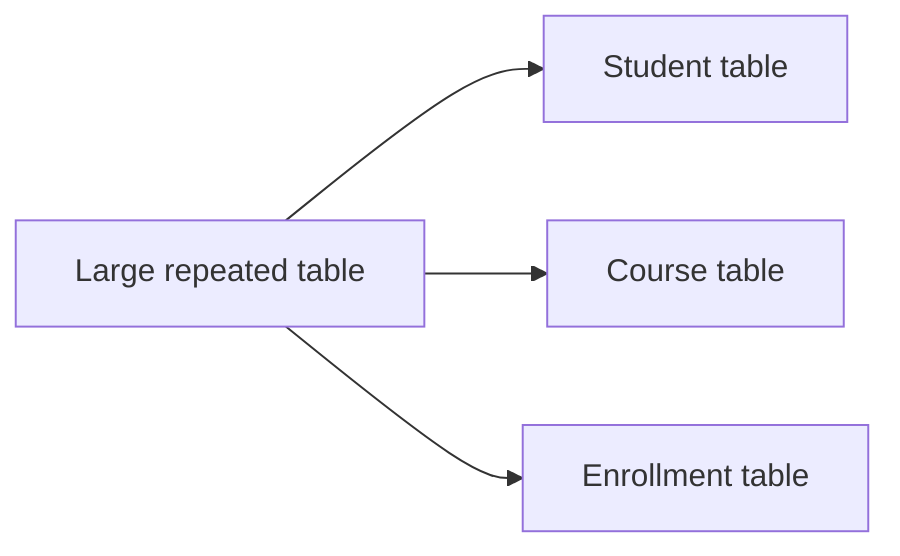

- **Student table:** student details.
- **Course table:** course details.
- **Enrollment table:** which student takes which course and the grade.

---

## Important words without heavy mathematics

### Functional dependency

A functional dependency simply means:

> If I know one value, I can reliably find another value.

Examples:

- Student ID tells us the student name.
- Course ID tells us the course name.
- Employee ID tells us the department ID.

Written briefly:

```text
StudentID → StudentName
CourseID → CourseName
```

Read the arrow as **determines**.

### Key

A key is a column, or a group of columns, that identifies one row uniquely.

- `StudentID` can identify one student.
- `(StudentID, CourseID)` can identify one enrollment.

### Candidate key

A candidate key is the smallest possible key. If removing one part makes it unable to identify a row, it is minimal.

### Prime attribute

An attribute that belongs to at least one candidate key.

### Non-prime attribute

An attribute that does not belong to any candidate key.

---

# Problem 1: Fix a list inside a cell — 1NF

## Question

| Student ID | Name | Phone numbers |
|---|---|---|
| S01 | Ravi | 9876, 9123 |
| S02 | Asha | 9988 |

Is this properly organized?

## Explanation

No. One cell contains multiple phone numbers. This makes searching and updating individual numbers difficult.

## Split the table

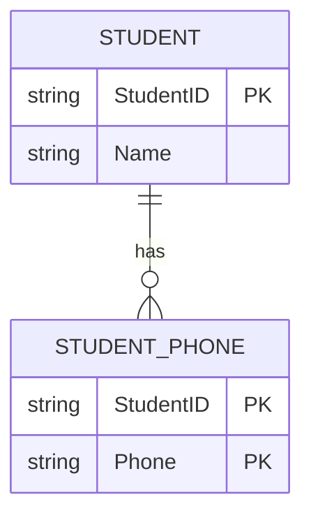

### STUDENT

| Student ID | Name |
|---|---|
| S01 | Ravi |
| S02 | Asha |

### STUDENT_PHONE

| Student ID | Phone |
|---|---|
| S01 | 9876 |
| S01 | 9123 |
| S02 | 9988 |

## Answer

The original table was not in **First Normal Form** because a cell contained a list. The new design stores one phone number per row.

---

# Problem 2: Student and course data mixed together — 2NF

## Question

```text
ENROLLMENT(StudentID, StudentName, CourseID, CourseName, Instructor, Grade)
```

Rules:

- Student ID tells us the student name.
- Course ID tells us the course name and instructor.
- Student ID plus Course ID tells us the grade.

## Understand the key first

One student can take many courses, and one course can have many students. Therefore, one column is not enough to identify an enrollment.

```text
Key = StudentID + CourseID
```

## Find the problem

The grade needs both the student and the course.

But:

- Student name needs only Student ID.
- Course name needs only Course ID.
- Instructor needs only Course ID.

They depend on only part of the combined key. This is called a **partial dependency**.

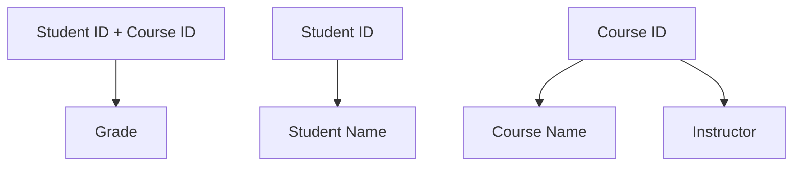

## Correct split

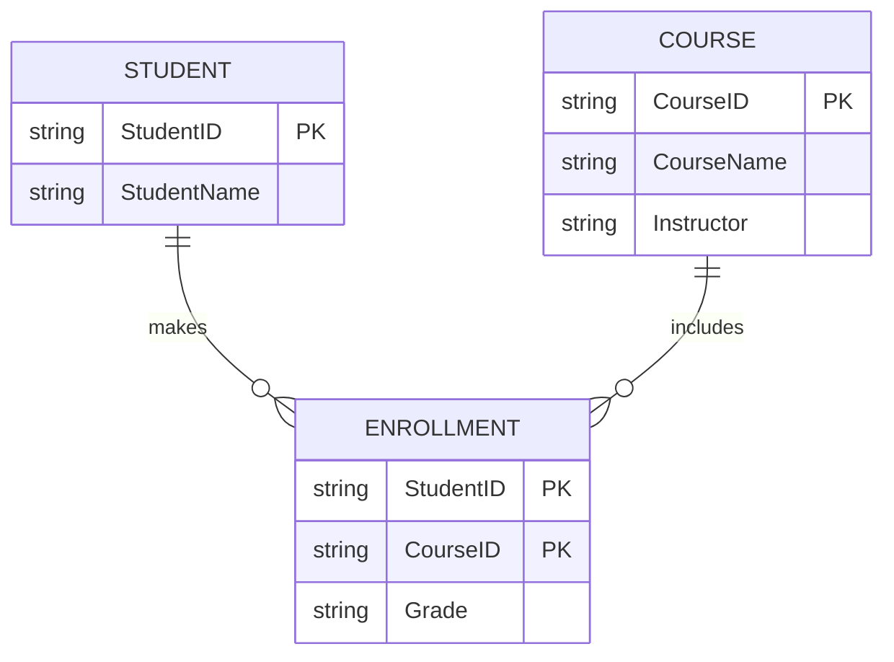

### Final tables

```text
STUDENT(StudentID, StudentName)
COURSE(CourseID, CourseName, Instructor)
ENROLLMENT(StudentID, CourseID, Grade)
```

## Simple conclusion

The original design is in **1NF but not 2NF**. The problem was that some details depended on only half of the combined key.

---

# Problem 3: Employee and department data mixed together — 3NF

## Question

```text
EMPLOYEE(EmpID, EmpName, DeptID, DeptName, DeptLocation)
```

Rules:

- Employee ID tells us the employee name and department ID.
- Department ID tells us the department name and location.

## Follow the chain

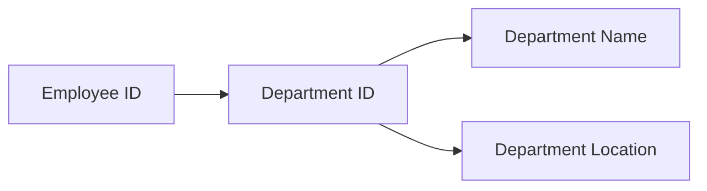

The employee ID indirectly gives the department name through the department ID.

This means department details are repeated for every employee in that department. This is called a **transitive dependency**.

## Correct split

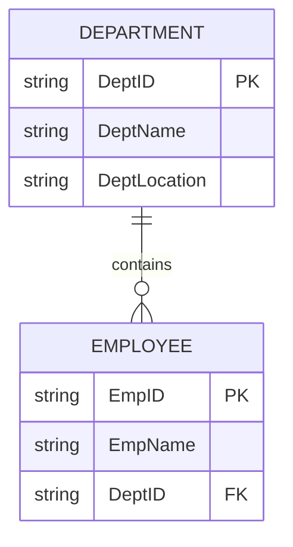

### Final tables

```text
EMPLOYEE(EmpID, EmpName, DeptID)
DEPARTMENT(DeptID, DeptName, DeptLocation)
```

## Simple conclusion

The original design can be in **2NF but not 3NF**. The solution is to move department details into a department table.

---

# Problem 4: Find the key by following the clues

## Question

```text
R(StudentID, CourseID, StudentName, CourseName, Grade)
```

Which columns identify one row of enrollment?

## Think in real life

- Student ID alone is not enough because one student can take many courses.
- Course ID alone is not enough because many students can take one course.
- Student ID plus Course ID identifies one particular enrollment.

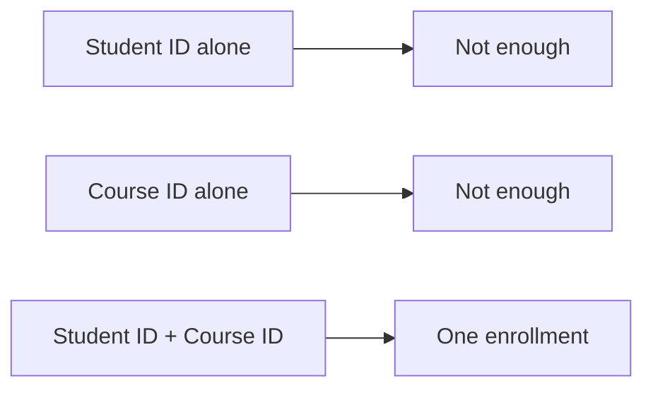

## Answer

```text
Candidate key = StudentID + CourseID
```

The grade belongs in the enrollment table because it describes the combination of one student and one course.

---

# Problem 5: Is this design in 3NF or BCNF?

## Question

```text
TEACH(Student, Course, Instructor)
```

Rules:

- A student taking a course has one instructor.
- An instructor teaches one particular course.

The important rule is:

```text
Instructor → Course
```

## Ask the simple question

Can Instructor alone identify one row of the table?

No. One instructor may teach many students. So `Instructor` is not a complete key.

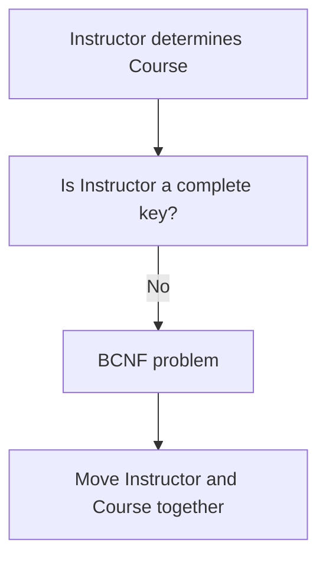

## Split the table

```text
INSTRUCTOR_COURSE(Instructor, Course)
STUDENT_INSTRUCTOR(Student, Instructor)
```

## Answer

This is a common example of a relation that can satisfy **3NF but fail BCNF**. BCNF is stricter: every column that determines another column must itself be a complete key.

---

# Problem 6: Two independent lists — 4NF

## Question

A student can have many hobbies and speak many languages. Hobbies and languages are unrelated.

| Student | Hobby | Language |
|---|---|---|
| Ravi | Chess | Hindi |
| Ravi | Chess | English |
| Ravi | Music | Hindi |
| Ravi | Music | English |

## What is wrong?

The database is combining two independent lists. If Ravi adds one hobby, several new combinations may be required.

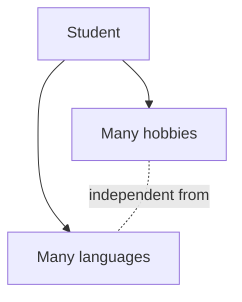

## Correct split

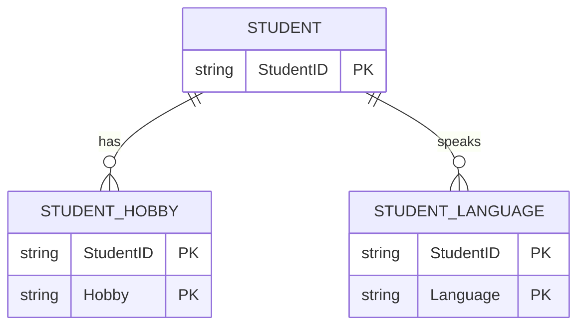

```text
STUDENT_HOBBY(Student, Hobby)
STUDENT_LANGUAGE(Student, Language)
```

## Answer

The original design has an independent multi-valued-data problem and is not in **4NF**.

---

# Problem 7: Check whether a split is safe

## Question

Original table:

```text
R(StudentID, StudentName, CourseID)
```

Rule:

```text
StudentID → StudentName
```

Proposed split:

```text
STUDENT(StudentID, StudentName)
ENROLLMENT(StudentID, CourseID)
```

## Is it safe?

Yes. The shared column is `StudentID`, and it identifies the student name in the first table.

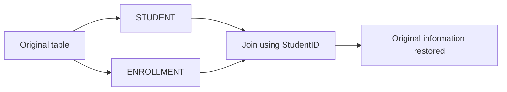

## Answer

This is a **lossless decomposition**. Joining the two tables using Student ID gives back the original information.

It is also dependency-preserving because the rule about Student ID and Student Name remains inside the student table.

---

# Problem 8: A bad split and spurious rows

## Question

Original table:

| Student | Course | Teacher |
|---|---|---|
| Ravi | DBMS | Rao |
| Asha | OS | Singh |

Someone splits it into:

**STUDENT_COURSE**

| Student | Course |
|---|---|
| Ravi | DBMS |
| Asha | OS |

**STUDENT_TEACHER**

| Student | Teacher |
|---|---|
| Ravi | Rao |
| Asha | Singh |

## Why can this be dangerous?

If rows are joined using only Student, the design may look correct here. But if the shared column does not properly determine one of the new tables, joining projections can create combinations that were never true in the original data.

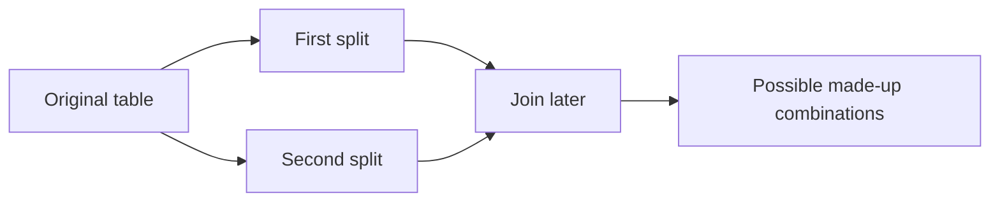

## Interview explanation

Do not say that every split is automatically safe. A decomposition must be checked for a **lossless join**. Otherwise, the database may create spurious rows when tables are joined again.

---

# Problem 9: Complete real-world problem

## Question

A college stores:

```text
REGISTRATION(StudentID, StudentName, CourseID, CourseName, TeacherID, TeacherName, Grade)
```

Rules:

- Student ID identifies the student name.
- Course ID identifies the course name and teacher ID.
- Teacher ID identifies the teacher name.
- Student ID plus Course ID identifies the grade.

## Step 1: Put each fact with its owner

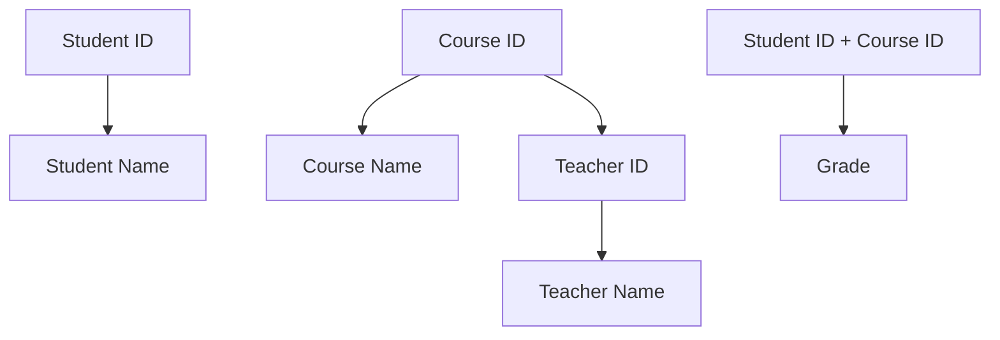

## Step 2: Create the tables

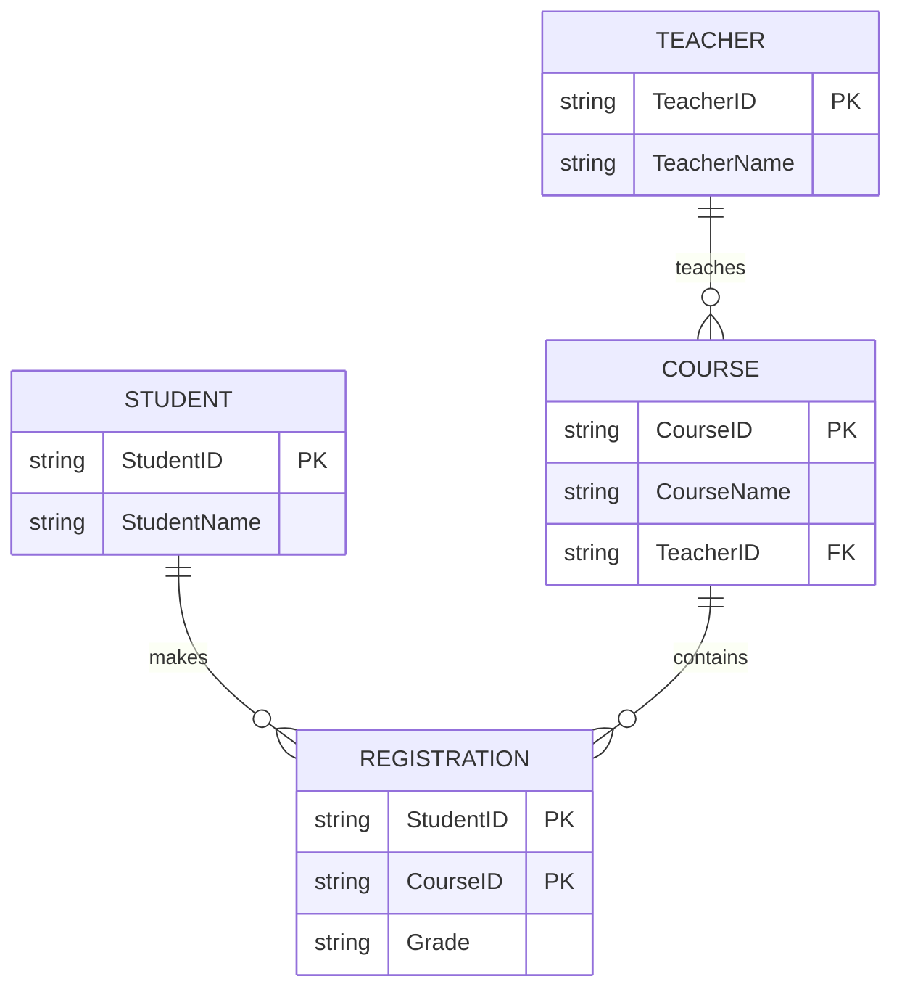

## Final answer

```text
STUDENT(StudentID, StudentName)
TEACHER(TeacherID, TeacherName)
COURSE(CourseID, CourseName, TeacherID)
REGISTRATION(StudentID, CourseID, Grade)
```

The original table is usually **1NF but not 2NF** because course details depend only on Course ID, not on the full registration key. Teacher name also passes through Teacher ID, so it should be stored separately.

---

# Very simple normal-form memory trick

```text
1NF  = No lists inside cells
2NF  = Details must depend on the whole combined key
3NF  = Do not store one non-key detail through another non-key detail
BCNF = Anything that determines something must be a complete key
4NF  = Keep independent lists in separate tables
5NF  = Avoid unnecessary complex join combinations
```

# TCS interview answers in plain language

### What is normalization?

Normalization is organizing database tables so that each fact is stored in the correct place and unnecessary repetition is reduced.

### Why do we normalize?

To avoid three common problems:

- Updating the same fact in many rows.
- Being unable to add a fact independently.
- Accidentally deleting a fact while deleting another row.

### What is 2NF?

A table is in 2NF when it is already in 1NF and every non-key detail depends on the complete key. It mainly matters when the key contains more than one column.

### What is 3NF?

A table is in 3NF when non-key details do not depend on other non-key details. In simple words: do not keep department information in the employee table if Department ID already owns that information.

### What is BCNF?

BCNF is a stricter version of 3NF. Every column or group of columns that determines another value must be capable of identifying a complete row.

### What is lossless decomposition?

After splitting a table, joining the smaller tables should reproduce the original information without losing rows or creating fake rows.

# Final exam method

1. Read the business rules carefully.
2. Ask: “What does each ID tell me?”
3. Find the smallest key for each real-world fact.
4. Move repeated details to the table whose ID owns them.
5. Keep relationships and transaction details in a linking table.
6. State the highest normal form and explain the first rule that fails.
7. If you split a table, mention whether the split is lossless.

The important skill is not memorizing symbols. It is recognizing **which fact belongs to which entity**.

## Reference notes

The standard definitions and progression of 1NF, 2NF, 3NF, BCNF, 4NF, and 5NF were cross-checked against common DBMS normalization references, including [DigitalOcean](https://www.digitalocean.com/community/tutorials/database-normalization), [GeeksforGeeks](https://www.geeksforgeeks.org/dbms/normal-forms-in-dbms/), [freeCodeCamp](https://www.freecodecamp.org/news/database-normalization-1nf-2nf-3nf-table-examples/), and [Naukri Code360](https://www.naukri.com/code360/library/normalization-in-dbms).
