# Object-Oriented Programming (OOP) - Complete Guide

> **Purpose**: Comprehensive revision notes for campus placement interviews. This document covers all fundamental OOP concepts with practical examples and visual representations.

---

## Table of Contents
1. [Core Concepts](#core-concepts)
2. [Classes and Objects](#classes-and-objects)
3. [Access Modifiers](#access-modifiers)
4. [Constructors](#constructors)
5. [The `this` Pointer](#the-this-pointer)
6. [Copy Mechanisms](#copy-mechanisms)
7. [Destructors](#destructors)
8. [Encapsulation](#encapsulation)
9. [Inheritance](#inheritance)
10. [Polymorphism](#polymorphism)
11. [Abstraction](#abstraction)
12. [Static Members](#static-members)

---

## Core Concepts

### What is OOP?

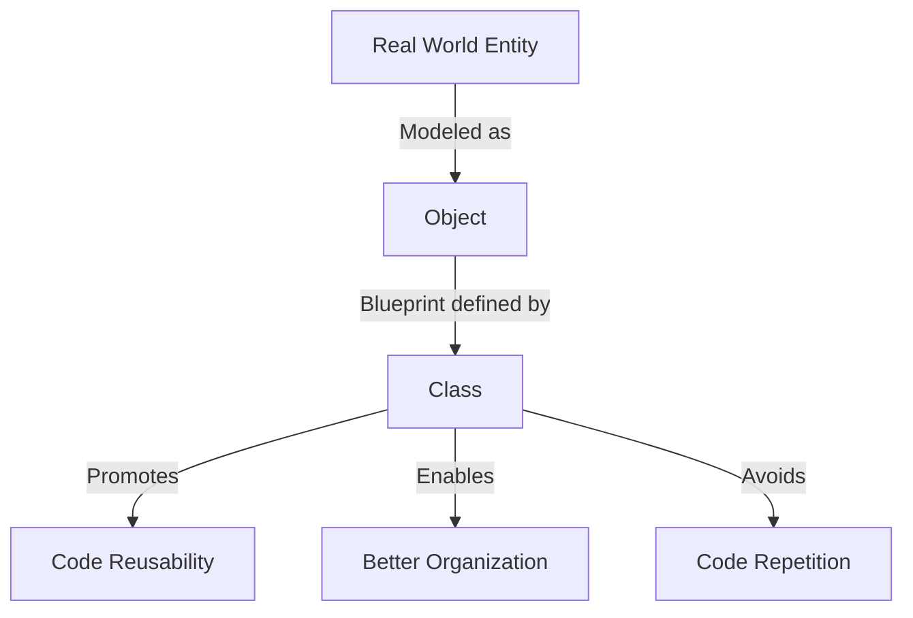

**Key Points:**
- **Objects**: Entities in the real world (e.g., Student, Teacher, Car)
- **Classes**: Blueprints that define the structure and behavior of objects
- **Benefits**:
  - Avoids code repetition
  - Promotes reusability
  - Better code organization
  - Easier maintenance

---

## Classes and Objects

### Basic Structure

```cpp
class ClassName {
private:
    // Private members (accessible only within class)

public:
    // Public members (accessible from anywhere)

protected:
    // Protected members (accessible in class and derived classes)
};
```

### Example: Teacher Class

```cpp
class Teacher {
private:
    int salary;  // Hidden from outside world

public:
    string name;
    string dept;
    string subject;

    // Methods to access private members
    void setSalary(int s) { salary = s; }
    int getSalary() { return salary; }
};
```

**Usage:**
```cpp
Teacher t1;
t1.name = "John";
t1.dept = "CSE";
t1.setSalary(50000);  // Access private member through method
```

---

## Access Modifiers

### Visibility Rules

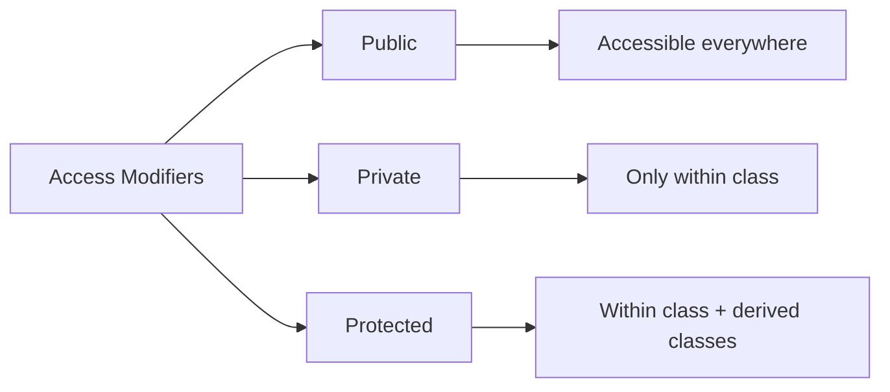

| Modifier | Within Class | Derived Class | Outside Class |
|----------|--------------|---------------|---------------|
| **public** | ✅ | ✅ | ✅ |
| **private** | ✅ | ❌ | ❌ |
| **protected** | ✅ | ✅ | ❌ |

**Key Points:**
- Default access modifier in C++ is **private**
- Use **private** for data hiding (encapsulation)
- Use **public** for interfaces (methods users can call)
- Use **protected** when you want derived classes to access members

---

## Constructors

### What are Constructors?

**Special member functions** that:
- Have the **same name as the class**
- **No return type** (not even void)
- Called **automatically** when an object is created
- Used for **initialization**
- Called **only once** per object

### Types of Constructors

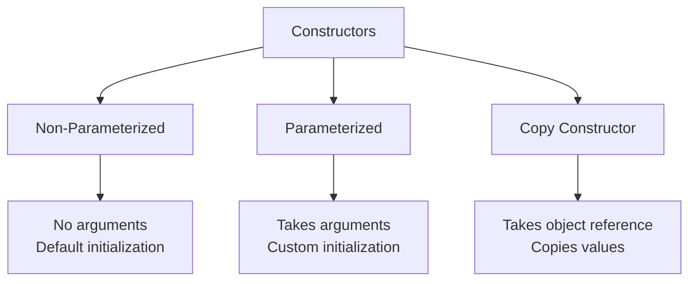

### 1. Non-Parameterized Constructor

```cpp
Teacher() {
    cout << "Constructor called" << endl;
    dept = "CSE";  // Default values
}
```

**Usage:**
```cpp
Teacher t1;  // Calls non-parameterized constructor
// Output: Constructor called
```

### 2. Parameterized Constructor

```cpp
Teacher(string name) {
    cout << "Parameterized constructor called" << endl;
    this->name = name;
    dept = "CSE";
}
```

**Usage:**
```cpp
Teacher t2("John");  // Calls parameterized constructor
// Output: Parameterized constructor called
```

### 3. Constructor Overloading (Compile-Time Polymorphism)

Having multiple constructors with different parameters:

```cpp
class Teacher {
public:
    // Constructor 1: No parameters
    Teacher() {
        dept = "CSE";
    }

    // Constructor 2: One parameter
    Teacher(string name) {
        this->name = name;
        dept = "CSE";
    }

    // Constructor 3: Two parameters
    Teacher(string name, string dept) {
        this->name = name;
        this->dept = dept;
    }
};
```

### 4. Copy Constructor

Used to create a copy of an existing object:

```cpp
Teacher(Teacher &t) {
    cout << "Copy constructor called" << endl;
    name = t.name;
    dept = t.dept;
    subject = t.subject;
    salary = t.salary;
}
```

**Usage:**
```cpp
Teacher t1("John");
Teacher t2(t1);  // Copy constructor creates t2 as a copy of t1
```

---

## The `this` Pointer

### What is `this`?

**Pointer to the current object** that is being manipulated.

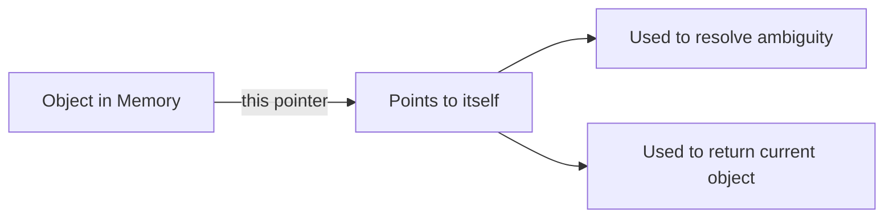

### Usage Examples

```cpp
class Teacher {
public:
    string name;

    // Case 1: Resolving name conflict
    Teacher(string name) {
        this->name = name;  // this->name refers to member variable
                           // name refers to parameter
    }

    // Case 2: Equivalent forms
    void setDept(string dept) {
        this->dept = dept;  // Explicit this pointer
        // OR
        dept = dept;        // Implicit (if no conflict)
    }

    // Case 3: Dereferencing
    void example() {
        this->name = "John";      // Using arrow operator
        (*this).name = "John";    // Equivalent: dereference then access
    }
};
```

**Key Points:**
- `this->member` is equivalent to `(*this).member`
- Use `this` when parameter names match member names
- `this` is a pointer, so use `->` operator

---

## Copy Mechanisms

### Shallow Copy vs Deep Copy

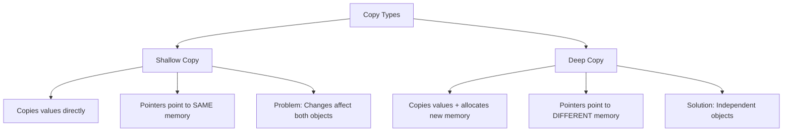

### Shallow Copy - The Problem

```cpp
class Student {
public:
    string name;
    double *cgpaptr;

    Student(string name, double cgpa) {
        this->name = name;
        cgpaptr = new double();
        *cgpaptr = cgpa;
    }

    // Default copy constructor (shallow copy)
    Student(Student &s) {
        name = s.name;
        cgpaptr = s.cgpaptr;  // Both point to SAME memory!
    }
};
```

**Problem Demonstration:**
```cpp
Student s1("John", 9.5);
Student s2(s1);          // Shallow copy

*s2.cgpaptr = 9.8;       // Modify s2's CGPA

cout << *s1.cgpaptr;     // Output: 9.8 (UNEXPECTED!)
cout << *s2.cgpaptr;     // Output: 9.8
```

**Memory Diagram (Shallow Copy):**
```
s1: name="John"  cgpaptr ----→ [9.5 → 9.8] ←---- cgpaptr  name="John" :s2
                               (Same Memory Location!)
```

### Deep Copy - The Solution

```cpp
class Student {
public:
    string name;
    double *cgpaptr;

    Student(string name, double cgpa) {
        this->name = name;
        cgpaptr = new double();
        *cgpaptr = cgpa;
    }

    // Custom copy constructor (deep copy)
    Student(Student &s) {
        name = s.name;
        cgpaptr = new double(*s.cgpaptr);  // Allocate NEW memory!
    }
};
```

**Solution Demonstration:**
```cpp
Student s1("John", 9.5);
Student s2(s1);          // Deep copy

*s2.cgpaptr = 9.8;       // Modify s2's CGPA

cout << *s1.cgpaptr;     // Output: 9.5 (UNCHANGED!)
cout << *s2.cgpaptr;     // Output: 9.8
```

**Memory Diagram (Deep Copy):**
```
s1: name="John"  cgpaptr ----→ [9.5]
                              (Separate Memory!)
s2: name="John"  cgpaptr ----→ [9.8]
```

### When to Use Each?

| Scenario | Use Shallow Copy | Use Deep Copy |
|----------|------------------|---------------|
| No dynamic memory | ✅ | ❌ (Unnecessary) |
| Has pointers/references | ❌ | ✅ (Must use!) |
| Simple data types only | ✅ | ❌ (Overhead) |
| Need independent copies | ❌ | ✅ |

---

## Destructors

### What are Destructors?

**Special member functions** that:
- Have the **same name as class** with `~` prefix
- **No return type** and **no parameters**
- Called **automatically** when object is destroyed
- Used to **free resources** (memory, files, connections)

### Syntax and Usage

```cpp
class Student {
public:
    double *cgpaptr;

    // Constructor
    Student(double cgpa) {
        cgpaptr = new double(cgpa);  // Allocate memory
    }

    // Destructor
    ~Student() {
        delete cgpaptr;  // Free memory
        cout << "Destructor called" << endl;
    }
};
```

### Destructor Order in Inheritance

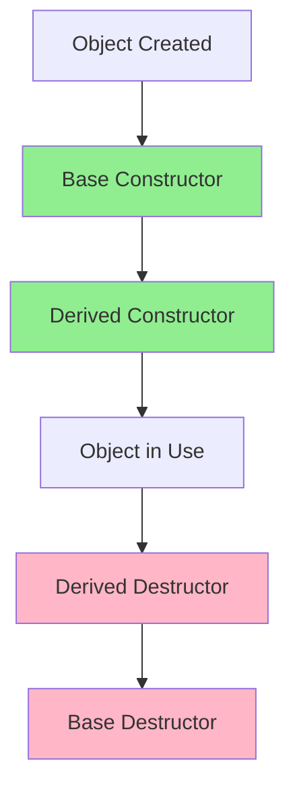

**Example:**
```cpp
class Person {
public:
    Person() { cout << "Person constructor\n"; }
    ~Person() { cout << "Person destructor\n"; }
};

class Student : public Person {
public:
    Student() { cout << "Student constructor\n"; }
    ~Student() { cout << "Student destructor\n"; }
};

// Usage
{
    Student s1;
}
// Output:
// Person constructor      ← Base class first
// Student constructor     ← Derived class second
// Student destructor      ← Derived class destroyed first
// Person destructor       ← Base class destroyed last
```

**Key Rule:** Destructors are called in **reverse order** of constructors!

---

## Encapsulation

### Definition

**Wrapping data and methods** that operate on that data within a single unit (class), while **hiding internal details** from the outside world.

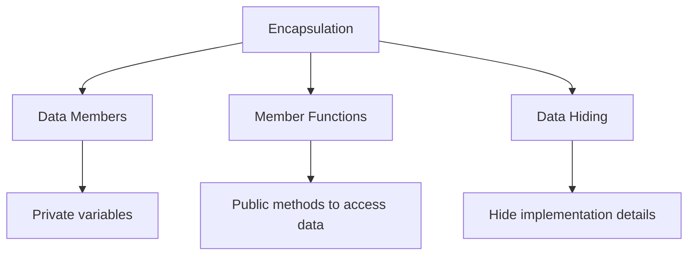

### Components

1. **Data/Properties + Member Functions = Class**
2. **Data Hiding**: Using private access modifiers
3. **Data Encapsulation**: Bundling data with methods

### Example: Bank Account

```cpp
class BankAccount {
private:
    double balance;        // Hidden data (data hiding)
    string accountNumber;

public:
    // Public interface (controlled access)
    void deposit(double amount) {
        if (amount > 0) {
            balance += amount;
        }
    }

    void withdraw(double amount) {
        if (amount > 0 && amount <= balance) {
            balance -= amount;
        }
    }

    double getBalance() {
        return balance;
    }
};
```

**Benefits:**
- ✅ Data is protected from unauthorized access
- ✅ Validation logic in one place
- ✅ Can change implementation without affecting users
- ✅ Better maintainability

### Encapsulation vs Abstraction

| Encapsulation | Abstraction |
|---------------|-------------|
| **How** - Implementation | **What** - Interface |
| Wrapping data + methods | Showing only essential details |
| Focus: Data security | Focus: Reducing complexity |
| Example: Private members | Example: Abstract classes |

---

## Inheritance

### Definition

Mechanism where one class (derived/child) acquires properties and behaviors from another class (base/parent).

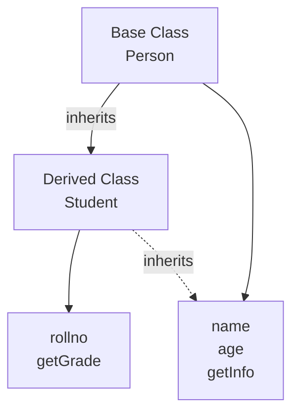

### Basic Syntax

```cpp
class Base {
public:
    int x;
    void show() { cout << "Base class\n"; }
};

class Derived : public Base {
public:
    int y;
    void display() { cout << "Derived class\n"; }
};
```

**Usage:**
```cpp
Derived obj;
obj.x = 10;      // Inherited from Base
obj.y = 20;      // Own member
obj.show();      // Inherited method
obj.display();   // Own method
```

### Constructor Calling in Inheritance

```cpp
class Person {
public:
    string name;
    int age;

    Person(string name, int age) {
        cout << "Person constructor\n";
        this->name = name;
        this->age = age;
    }
};

class Student : public Person {
public:
    int rollno;

    // Call base constructor using initializer list
    Student(string name, int age, int rollno) : Person(name, age) {
        cout << "Student constructor\n";
        this->rollno = rollno;
    }
};
```

**Usage:**
```cpp
Student s1("John", 20, 123);
// Output:
// Person constructor    ← Base first
// Student constructor   ← Derived second
```

---

## Modes of Inheritance

### Inheritance Visibility Table

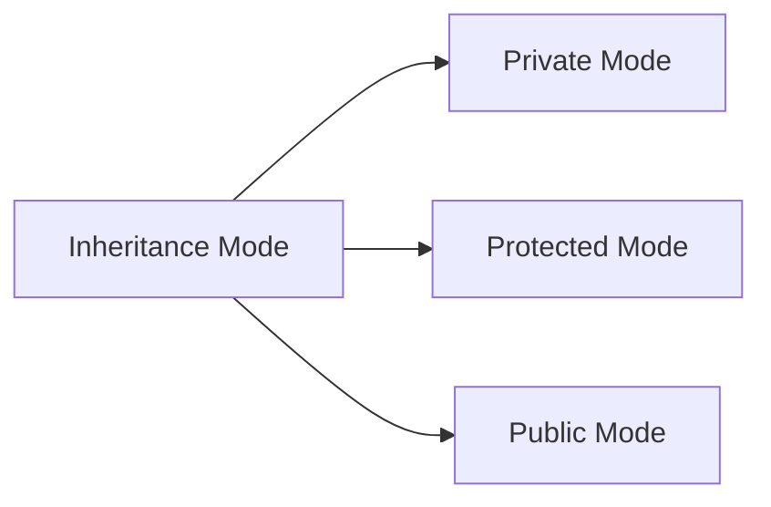

| Base Class Member | Private Inheritance | Protected Inheritance | Public Inheritance |
|-------------------|--------------------|-----------------------|-------------------|
| **Private** | ❌ Not Inherited | ❌ Not Inherited | ❌ Not Inherited |
| **Protected** | 🔒 Private | 🔐 Protected | 🔐 Protected |
| **Public** | 🔒 Private | 🔐 Protected | 🟢 Public |

### Detailed Explanation

1. **Private members**: NEVER inherited (not accessible in derived class)

2. **Private Inheritance** (`class Derived : private Base`)
   - Protected members → become Private
   - Public members → become Private

3. **Protected Inheritance** (`class Derived : protected Base`)
   - Protected members → stay Protected
   - Public members → become Protected

4. **Public Inheritance** (`class Derived : public Base`) ⭐ Most Common
   - Protected members → stay Protected
   - Public members → stay Public

### Visual Example

```cpp
// Base class
class Base {
private:
    int a;      // Never accessible in derived
protected:
    int b;
public:
    int c;
};

// Public inheritance (most common)
class Derived1 : public Base {
    // b is protected
    // c is public
};

// Protected inheritance
class Derived2 : protected Base {
    // b is protected
    // c is protected
};

// Private inheritance
class Derived3 : private Base {
    // b is private
    // c is private
};
```

---

## Types of Inheritance

### 1. Single Inheritance

One base class → One derived class

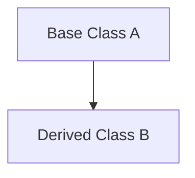

```cpp
class A {
public:
    int x;
};

class B : public A {
public:
    int y;
};

// B inherits x from A
```

---

### 2. Multiple Inheritance

Multiple base classes → One derived class

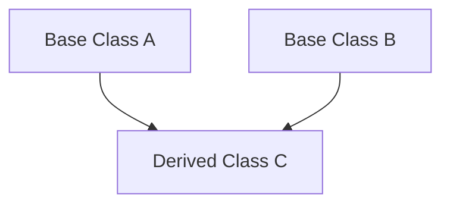

```cpp
class A {
public:
    int x;
};

class B {
public:
    int y;
};

class C : public A, public B {
public:
    int z;
};

// Constructor must call both base constructors
C() : A(), B() { }
```

**Usage:**
```cpp
C obj;
obj.x = 10;  // From A
obj.y = 20;  // From B
obj.z = 30;  // Own member
```

---

### 3. Multi-level Inheritance

Chain of inheritance: A → B → C

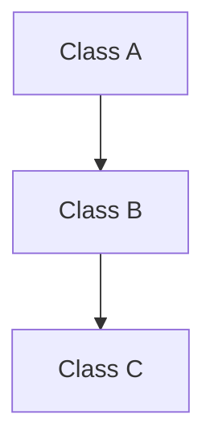

```cpp
class A {
public:
    int x;
};

class B : public A {
public:
    int y;
};

class C : public B {
public:
    int z;
};

// Constructor calling chain
C() : B() { }  // B's constructor calls A's constructor
```

**Constructor Call Order:** A → B → C
**Destructor Call Order:** C → B → A

---

### 4. Hierarchical Inheritance

One base class → Multiple derived classes

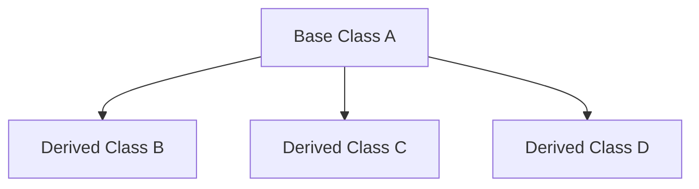

```cpp
class A {
public:
    int x;
};

class B : public A {
public:
    int y;
};

class C : public A {
public:
    int z;
};

class D : public A {
public:
    int w;
};

// B, C, and D all inherit from A independently
```

---

### 5. Hybrid Inheritance

Combination of multiple inheritance types (multiple + multi-level)

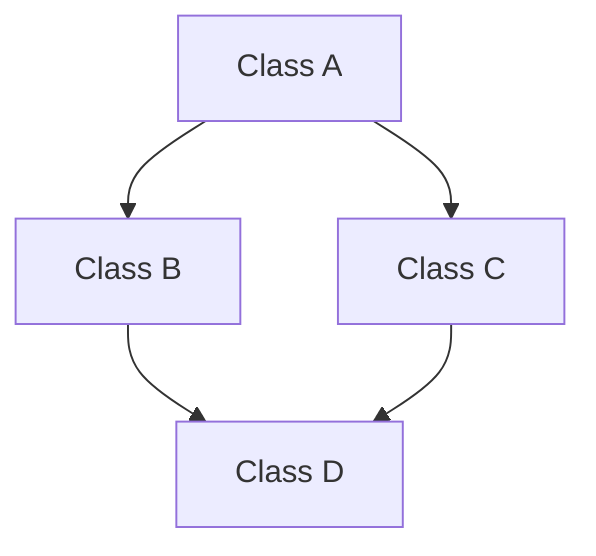

```cpp
class A {
public:
    int x;
};

class B : public A {
public:
    int y;
};

class C : public A {
public:
    int z;
};

class D : public B, public C {
public:
    int w;
};

// D inherits from both B and C
D() : B(), C() { }
```

**Diamond Problem:** D has two copies of A (one through B, one through C).
**Solution:** Use virtual inheritance.

---

### Summary Table

| Type | Structure | Example |
|------|-----------|---------|
| **Single** | A → B | Person → Student |
| **Multiple** | A, B → C | Employee, Student → TeachingAssistant |
| **Multi-level** | A → B → C | Person → Student → GradStudent |
| **Hierarchical** | A → B, C, D | Shape → Circle, Rectangle, Triangle |
| **Hybrid** | Combination | Employee, Student → Manager, TeachingAssistant |

---

## Polymorphism

### Definition

**"Many forms"** - The ability of objects to take different forms or behave differently in different contexts.

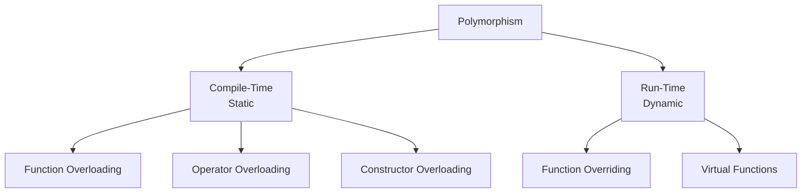

---

## Compile-Time Polymorphism

Decision made **at compile time** based on function signatures.

### 1. Function Overloading

Same function name, different parameters.

```cpp
class Calculator {
public:
    // Function 1: No parameters
    void print() {
        cout << "No parameters\n";
    }

    // Function 2: Int parameter
    void print(int x) {
        cout << "Int: " << x << "\n";
    }

    // Function 3: Double parameter
    void print(double x) {
        cout << "Double: " << x << "\n";
    }

    // Function 4: Two parameters
    void print(int x, int y) {
        cout << "Two ints: " << x << ", " << y << "\n";
    }
};
```

**Usage:**
```cpp
Calculator calc;
calc.print();        // Calls function 1
calc.print(10);      // Calls function 2 (int)
calc.print(3.14);    // Calls function 3 (double)
calc.print(5, 7);    // Calls function 4
```

**How it works:** Compiler determines which function to call based on:
- Number of parameters
- Type of parameters
- Order of parameters

---

### 2. Constructor Overloading

Multiple constructors with different parameters (covered earlier).

```cpp
class Student {
public:
    Student() { }                    // No parameters
    Student(string name) { }         // One parameter
    Student(string name, int age) { } // Two parameters
};
```

---

### 3. Operator Overloading

Redefining operators for custom classes.

```cpp
class Complex {
public:
    int real, imag;

    Complex(int r, int i) : real(r), imag(i) { }

    // Overload + operator
    Complex operator+(Complex &c) {
        Complex result(real + c.real, imag + c.imag);
        return result;
    }

    // Overload << operator for printing
    friend ostream& operator<<(ostream &os, Complex &c) {
        os << c.real << " + " << c.imag << "i";
        return os;
    }
};
```

**Usage:**
```cpp
Complex c1(3, 4);
Complex c2(1, 2);
Complex c3 = c1 + c2;  // Uses overloaded + operator
cout << c3;            // Output: 4 + 6i
```

---

## Run-Time Polymorphism

Decision made **at runtime** based on object type.

### Function Overriding

Same function name and parameters in parent and child classes.

```cpp
class Parent {
public:
    void show() {
        cout << "Parent class\n";
    }
};

class Child : public Parent {
public:
    void show() {  // Overrides parent's show()
        cout << "Child class\n";
    }
};
```

**Usage:**
```cpp
Child obj;
obj.show();  // Output: Child class
```

**Problem without Virtual Functions:**
```cpp
Parent *ptr = new Child();
ptr->show();  // Output: Parent class (UNEXPECTED!)
```

---

### Virtual Functions

Enable **dynamic dispatch** - function called is determined at runtime.

```cpp
class Parent {
public:
    virtual void show() {  // Virtual keyword
        cout << "Parent class\n";
    }
};

class Child : public Parent {
public:
    void show() override {  // Overrides virtual function
        cout << "Child class\n";
    }
};
```

**Usage:**
```cpp
Parent *ptr = new Child();
ptr->show();  // Output: Child class (CORRECT!)
```

**How it works:**


### Virtual Function Rules

1. Declared with `virtual` keyword in base class
2. Overridden in derived class (optional `override` keyword)
3. Must have **same signature** (name + parameters)
4. Called through **base class pointer/reference**
5. Dynamic in nature - resolved at **runtime**

---

### Pure Virtual Functions

Functions with **no implementation** in base class.

```cpp
class Shape {
public:
    virtual void draw() = 0;  // Pure virtual function
    virtual double area() = 0;
};
```

**Key Points:**
- Declared with `= 0`
- Makes the class **abstract**
- **Must** be overridden in derived class
- Cannot instantiate abstract class

---

## Abstraction

### Definition

**Showing only essential information** and hiding implementation details.

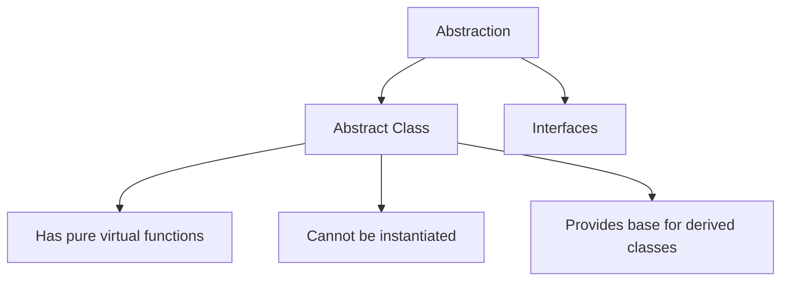

### Abstract Class

A class with **at least one pure virtual function**.

```cpp
class AbstractClass {
public:
    // Pure virtual function (no implementation)
    virtual void print() = 0;

    // Regular function (has implementation)
    void show() {
        cout << "Concrete function in abstract class\n";
    }
};

class DerivedClass : public AbstractClass {
public:
    // Must override pure virtual function
    void print() override {
        cout << "Implemented in derived class\n";
    }
};
```

**Usage:**
```cpp
// AbstractClass obj;  // ERROR: Cannot instantiate abstract class
DerivedClass obj;      // OK: Derived class is concrete
obj.print();           // Output: Implemented in derived class
obj.show();            // Output: Concrete function in abstract class
```

### Real-World Example: Payment System

```cpp
class Payment {
public:
    virtual void processPayment(double amount) = 0;  // Pure virtual
    virtual void generateReceipt() = 0;              // Pure virtual

    void logTransaction() {  // Concrete method
        cout << "Transaction logged\n";
    }
};

class CreditCardPayment : public Payment {
public:
    void processPayment(double amount) override {
        cout << "Processing credit card payment: $" << amount << "\n";
    }

    void generateReceipt() override {
        cout << "Credit card receipt generated\n";
    }
};

class UPIPayment : public Payment {
public:
    void processPayment(double amount) override {
        cout << "Processing UPI payment: ₹" << amount << "\n";
    }

    void generateReceipt() override {
        cout << "UPI receipt generated\n";
    }
};
```

**Usage:**
```cpp
Payment *payment1 = new CreditCardPayment();
payment1->processPayment(100.0);
payment1->generateReceipt();
payment1->logTransaction();

Payment *payment2 = new UPIPayment();
payment2->processPayment(500.0);
payment2->generateReceipt();
payment2->logTransaction();
```

### Abstract Class vs Interface

| Abstract Class | Interface (Pure Abstract) |
|----------------|---------------------------|
| Can have concrete methods | Only pure virtual functions |
| Can have member variables | No member variables |
| Single inheritance | Multiple inheritance (workaround) |
| Use: Partial abstraction | Use: Complete abstraction |

---

## Static Members

### Definition

Members that **belong to the class** itself, not to any specific object instance.

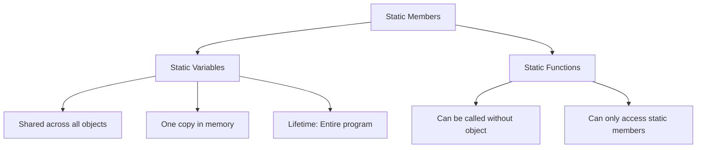

---

### Static Variables

**Shared** by all objects of the class.

```cpp
class StaticExample {
public:
    static int count;  // Declaration

    StaticExample() {
        count++;  // Incremented for each object created
    }
};

// Definition and initialization (MUST be done outside class)
int StaticExample::count = 0;
```

**Usage:**
```cpp
cout << StaticExample::count;  // Output: 0 (no objects yet)

StaticExample obj1;
cout << StaticExample::count;  // Output: 1

StaticExample obj2;
StaticExample obj3;
cout << StaticExample::count;  // Output: 3

cout << obj1.count;  // Output: 3 (same variable!)
cout << obj2.count;  // Output: 3
```

**Memory Diagram:**
```
Class StaticExample                Objects
┌─────────────────┐              ┌─────────┐
│ static count: 3 │◄─────────────┤  obj1   │
└─────────────────┘              └─────────┘
        ▲                        ┌─────────┐
        └────────────────────────┤  obj2   │
                                 └─────────┘
                                 ┌─────────┐
                                 │  obj3   │
                                 └─────────┘
        (Only ONE copy in memory!)
```

---

### Static Functions

Can be called **without creating an object**.

```cpp
class MathUtils {
public:
    static int value;  // Static variable

    // Static function
    static int square(int x) {
        return x * x;
    }

    static void setValue(int v) {
        value = v;  // Can access static members
        // name = "test";  // ERROR: Cannot access non-static members
    }

    static int getValue() {
        return value;
    }
};

int MathUtils::value = 0;  // Initialize static variable
```

**Usage:**
```cpp
// Call without creating object
cout << MathUtils::square(5);  // Output: 25

MathUtils::setValue(10);
cout << MathUtils::getValue();  // Output: 10

// Can also call using object (but not necessary)
MathUtils obj;
cout << obj.square(3);  // Output: 9
```

### Static Function Restrictions

```cpp
class Example {
public:
    static int staticVar;
    int normalVar;

    static void staticFunc() {
        staticVar = 10;     // ✅ OK: Access static variable
        // normalVar = 20;  // ❌ ERROR: Cannot access non-static
        // normalFunc();    // ❌ ERROR: Cannot call non-static function
    }

    void normalFunc() {
        staticVar = 30;     // ✅ OK: Non-static can access static
        normalVar = 40;     // ✅ OK: Access non-static variable
        staticFunc();       // ✅ OK: Call static function
    }
};
```

### When to Use Static?

| Use Static When | Example |
|----------------|---------|
| Counting objects | `static int count;` |
| Configuration values | `static const double PI;` |
| Utility functions | `static int max(int a, int b);` |
| Shared resources | `static DatabaseConnection db;` |

**Key Rule:** Static members belong to the **class**, not to individual **objects**.

---

## Quick Reference: Key Concepts

### Four Pillars of OOP

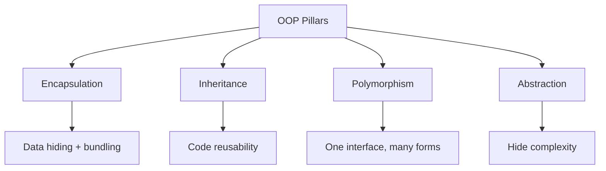

### Constructor vs Destructor

| Aspect | Constructor | Destructor |
|--------|-------------|------------|
| Name | Same as class | `~ClassName` |
| Return type | None | None |
| Parameters | Can have | Cannot have |
| When called | Object creation | Object destruction |
| Purpose | Initialize | Cleanup/free resources |
| Overloading | Yes ✅ | No ❌ |

### Polymorphism Quick Reference

| Type | Binding Time | Examples |
|------|--------------|----------|
| **Compile-Time** | Compile | Function overloading, Operator overloading |
| **Run-Time** | Runtime | Virtual functions, Function overriding |

### Access Modifier Summary

```cpp
class Example {
private:
    int x;        // Only within class

protected:
    int y;        // Within class + derived classes

public:
    int z;        // Everywhere

    void setX(int val) { x = val; }  // Getter/Setter pattern
    int getX() { return x; }
};
```

---

## Interview Tips

### Most Asked Questions

1. **What is OOP?**
   - Programming paradigm based on "objects" that contain data and code
   - Four pillars: Encapsulation, Inheritance, Polymorphism, Abstraction

2. **Difference between class and object?**
   - Class: Blueprint/template
   - Object: Instance of a class (actual entity in memory)

3. **Explain polymorphism with example**
   - Ability to take many forms
   - Compile-time: Function overloading
   - Runtime: Virtual functions

4. **What is virtual function?**
   - Function in base class that can be overridden
   - Enables runtime polymorphism
   - Uses vtable for dynamic dispatch

5. **Shallow copy vs Deep copy?**
   - Shallow: Copies pointer addresses (shared memory)
   - Deep: Copies actual data (independent copies)
   - Use deep copy when class has dynamic memory

6. **What is abstract class?**
   - Class with at least one pure virtual function
   - Cannot be instantiated
   - Provides interface for derived classes

7. **Why use encapsulation?**
   - Data security
   - Controlled access
   - Easy maintenance
   - Validation in one place

8. **Constructor types?**
   - Default (non-parameterized)
   - Parameterized
   - Copy constructor
   - All can be overloaded

9. **When is destructor called?**
   - Automatically when object goes out of scope
   - When delete is called on pointer
   - Program termination

10. **Static vs non-static members?**
    - Static: Belongs to class, shared by all objects
    - Non-static: Belongs to individual objects

### Common Mistakes to Avoid

❌ **Wrong:**
```cpp
// Forgetting to initialize static variables
class A {
    static int count;  // Declaration only
};
// Missing: int A::count = 0;
```

✅ **Correct:**
```cpp
class A {
    static int count;
};
int A::count = 0;  // Initialize outside class
```

---

❌ **Wrong:**
```cpp
// Not using virtual for polymorphism
class Base {
    void show() { }  // Not virtual
};
```

✅ **Correct:**
```cpp
class Base {
    virtual void show() { }  // Virtual
};
```

---

❌ **Wrong:**
```cpp
// Shallow copy with pointers
Student(Student &s) {
    ptr = s.ptr;  // Both point to same memory
}
```

✅ **Correct:**
```cpp
// Deep copy with pointers
Student(Student &s) {
    ptr = new int(*s.ptr);  // Allocate new memory
}
```

---

## Summary Checklist

Before your interview, ensure you understand:

- [x] **Classes and Objects** - Blueprint vs instance
- [x] **Access Modifiers** - public, private, protected
- [x] **Constructors** - Types and overloading
- [x] **Copy Constructor** - Shallow vs deep copy
- [x] **Destructor** - Resource cleanup
- [x] **this Pointer** - Reference to current object
- [x] **Encapsulation** - Data hiding
- [x] **Inheritance** - Code reusability (types and modes)
- [x] **Polymorphism** - Compile-time and runtime
- [x] **Virtual Functions** - Dynamic dispatch
- [x] **Abstract Classes** - Pure virtual functions
- [x] **Static Members** - Class-level members

---

## Practice Problems

### Problem 1: Design a Library System
Create classes for Book, Member, and Library with proper encapsulation and inheritance.

### Problem 2: Shape Hierarchy
Implement an abstract Shape class with derived classes Circle, Rectangle, Triangle using polymorphism.

### Problem 3: Bank Account System
Design a banking system with different account types using inheritance and demonstrate runtime polymorphism.

### Problem 4: Employee Management
Create an employee hierarchy with Manager, Engineer, and Intern classes demonstrating all OOP concepts.

---

## Additional Resources

- **Practice**: LeetCode, GeeksforGeeks OOP problems
- **Visualization**: Python Tutor for memory diagrams
- **Deeper Dive**: "Effective C++" by Scott Meyers

---

**Last Updated**: November 24, 2024
**Purpose**: Campus Placement Interview Preparation
**Coverage**: Complete OOP fundamentals with C++ examples

---

> **Note**: This document consolidates all OOP concepts from the codebase. Practice implementing these concepts in your own projects for better retention. Good luck with your interviews! 🚀
