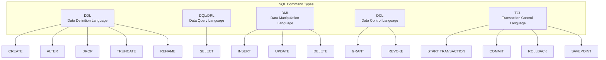
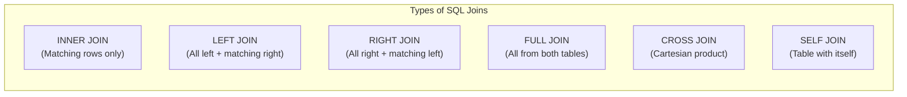

# 📚 SQL Complete Guide for Tech Interviews

> A comprehensive, interview-focused SQL reference guide. This document covers everything from fundamentals to advanced concepts, designed to replace lengthy PDF notes with clear, memorable explanations.

---

## 🎯 What is SQL?

**SQL (Structured Query Language)** is the standard language for communicating with relational databases. Think of it as the "conversation language" between you and your database — you ask questions (queries), and the database responds with data.

**Key Insight for Interviews:** SQL is **NOT** a database itself. It's a _language_ used to interact with databases. MySQL, PostgreSQL, Oracle — these are **RDBMS** (Relational Database Management Systems) that _use_ SQL.

```
┌─────────────────────────────────────────────────────────┐
│  You (Client)  →  SQL Commands  →  RDBMS (MySQL, etc.) │
│                                         ↓               │
│                                    Database Tables      │
└─────────────────────────────────────────────────────────┘
```

---

## 🔄 CRUD Operations — The Foundation

Every database operation falls into one of these four categories. Memorize this — interviewers love asking about it.

| Operation  | SQL Command | Purpose                    |
| ---------- | ----------- | -------------------------- |
| **C**reate | `INSERT`    | Add new records to a table |
| **R**ead   | `SELECT`    | Retrieve data from tables  |
| **U**pdate | `UPDATE`    | Modify existing records    |
| **D**elete | `DELETE`    | Remove records from tables |

---

## 📊 SQL Command Categories

Understanding how SQL commands are categorized helps you think about database operations systematically. Each category serves a distinct purpose.



### 1️⃣ DDL (Data Definition Language) — Defines Structure

These commands define the "skeleton" of your database. They create, modify, or delete the structure (schema) itself, not the data within.

| Command    | Purpose                              | Example                                     |
| ---------- | ------------------------------------ | ------------------------------------------- |
| `CREATE`   | Create tables, databases, views      | `CREATE TABLE users (id INT);`              |
| `ALTER`    | Modify table structure               | `ALTER TABLE users ADD email VARCHAR(255);` |
| `DROP`     | Delete tables, databases entirely    | `DROP TABLE users;`                         |
| `TRUNCATE` | Remove ALL rows (faster than DELETE) | `TRUNCATE TABLE users;`                     |
| `RENAME`   | Rename database objects              | `ALTER TABLE users RENAME TO customers;`    |

### 2️⃣ DQL/DRL (Data Query Language) — Reads Data

Only one command here, but it's the most powerful and complex one you'll use.

```sql
SELECT column1, column2 FROM table_name WHERE condition;
```

### 3️⃣ DML (Data Manipulation Language) — Modifies Data

These change the actual data inside tables, not the structure.

| Command  | Purpose              |
| -------- | -------------------- |
| `INSERT` | Add new rows         |
| `UPDATE` | Change existing rows |
| `DELETE` | Remove specific rows |

### 4️⃣ DCL (Data Control Language) — Manages Permissions

Controls who can do what in the database.

```sql
GRANT SELECT, INSERT ON employees TO user_john;  -- Give permissions
REVOKE INSERT ON employees FROM user_john;        -- Take away permissions
```

### 5️⃣ TCL (Transaction Control Language) — Manages Transactions

Ensures data integrity when multiple operations must succeed or fail together.

```sql
START TRANSACTION;
    UPDATE accounts SET balance = balance - 100 WHERE id = 1;
    UPDATE accounts SET balance = balance + 100 WHERE id = 2;
COMMIT;  -- Make changes permanent (or ROLLBACK to undo everything)
```

---

## 📦 SQL Data Types

Choosing the right data type is crucial for performance and storage efficiency. Here's what you need to know:

### String Types

| Type         | Size                    | When to Use                                            |
| ------------ | ----------------------- | ------------------------------------------------------ |
| `CHAR(n)`    | Fixed n bytes           | When all values have same length (e.g., country codes) |
| `VARCHAR(n)` | Variable, up to n bytes | **Most common choice** — names, emails, etc.           |
| `TEXT`       | Up to 65,535 bytes      | Long text content                                      |
| `LONGTEXT`   | Up to 4GB               | Very large documents                                   |

> 💡 **Interview Tip:** `VARCHAR` is preferred over `CHAR` because it only uses the space needed. `CHAR(100)` always uses 100 bytes, while `VARCHAR(100)` uses only what's necessary.

### Numeric Types

```
Size Order: TINYINT < SMALLINT < MEDIUMINT < INT < BIGINT
```

| Type      | Range               | Use Case                                  |
| --------- | ------------------- | ----------------------------------------- |
| `TINYINT` | -128 to 127         | Age, status flags                         |
| `INT`     | ±2.1 billion        | Most numeric data                         |
| `BIGINT`  | Huge numbers        | IDs for large systems                     |
| `FLOAT`   | 23 digits precision | Approximate decimals                      |
| `DOUBLE`  | 53 digits precision | Scientific calculations                   |
| `DECIMAL` | Exact precision     | **Money** — always use this for currency! |

### Date/Time Types

| Type        | Format              | Example                              |
| ----------- | ------------------- | ------------------------------------ |
| `DATE`      | YYYY-MM-DD          | '2024-01-15'                         |
| `TIME`      | HH:MM:SS            | '14:30:00'                           |
| `DATETIME`  | YYYY-MM-DD HH:MM:SS | '2024-01-15 14:30:00'                |
| `TIMESTAMP` | Auto-updates        | Great for `created_at`, `updated_at` |

### Special Types

| Type      | Description                            |
| --------- | -------------------------------------- |
| `BOOLEAN` | 0 (false) or 1 (true)                  |
| `ENUM`    | One value from a predefined list       |
| `SET`     | Multiple values from a predefined list |

---

## 🏗️ Database & Table Management (DDL)

### Creating and Managing Databases

```sql
-- Create a new database (IF NOT EXISTS prevents errors)
CREATE DATABASE IF NOT EXISTS company_db;

-- Switch to use this database
USE company_db;

-- Delete a database
DROP DATABASE IF EXISTS company_db;

-- See all databases
SHOW DATABASES;

-- See all tables in current database
SHOW TABLES;
```

### Creating Tables

```sql
CREATE TABLE employees (
    id INT PRIMARY KEY AUTO_INCREMENT,
    first_name VARCHAR(50) NOT NULL,
    last_name VARCHAR(50) NOT NULL,
    email VARCHAR(100) UNIQUE,
    salary DECIMAL(10, 2) DEFAULT 0.00,
    department_id INT,
    hire_date DATE,
    is_active BOOLEAN DEFAULT TRUE,

    -- Constraints can also be defined at the end
    CONSTRAINT fk_department
        FOREIGN KEY (department_id) REFERENCES departments(id)
);
```

---

## 🔐 Constraints — Rules for Data Integrity

Constraints are rules enforced on table columns to ensure data accuracy and reliability. This is a **hot interview topic**.

### Primary Key

The unique identifier for each row. Every table should have one.

```sql
CREATE TABLE customers (
    id INT PRIMARY KEY,  -- Method 1: Inline
    name VARCHAR(100)
);

-- OR

CREATE TABLE customers (
    id INT,
    name VARCHAR(100),
    PRIMARY KEY (id)     -- Method 2: At the end
);
```

**Rules:** Must be NOT NULL, must be UNIQUE, only ONE per table.

### Foreign Key

Creates a relationship between two tables. It references the Primary Key of another table.

```sql
CREATE TABLE orders (
    order_id INT PRIMARY KEY,
    order_date DATE,
    customer_id INT,

    -- This links orders to customers
    FOREIGN KEY (customer_id) REFERENCES customers(id)
        ON DELETE CASCADE      -- If customer deleted, delete their orders
        ON UPDATE CASCADE      -- If customer ID changes, update here too
);
```

```
┌─────────────────┐         ┌─────────────────┐
│   customers     │         │     orders      │
├─────────────────┤         ├─────────────────┤
│ id (PK)     ────┼─────────┼─ customer_id(FK)│
│ name            │         │ order_id (PK)   │
│ email           │         │ order_date      │
└─────────────────┘         └─────────────────┘
```

### Other Constraints

```sql
CREATE TABLE products (
    id INT PRIMARY KEY,
    name VARCHAR(100) NOT NULL,           -- Cannot be empty
    sku VARCHAR(50) UNIQUE,               -- No duplicates allowed
    price DECIMAL(10,2) CHECK (price > 0), -- Custom validation
    quantity INT DEFAULT 0                 -- Default value if not provided
);
```

> 💡 **Key Insight:** An attribute CAN be both Primary Key AND Foreign Key in the same table (common in junction/bridge tables for many-to-many relationships).

---

## 🔧 ALTER Operations — Modifying Tables

Once a table exists, you can modify its structure without recreating it.

```sql
-- Add a new column
ALTER TABLE employees ADD phone VARCHAR(20);

-- Add multiple columns at once
ALTER TABLE employees
    ADD middle_name VARCHAR(50),
    ADD birth_date DATE;

-- Modify column data type
ALTER TABLE employees MODIFY phone CHAR(15);

-- Rename a column (also requires new datatype)
ALTER TABLE employees CHANGE COLUMN phone contact_number VARCHAR(20);

-- Delete a column
ALTER TABLE employees DROP COLUMN middle_name;

-- Rename the entire table
ALTER TABLE employees RENAME TO staff;
```

---

## 📖 SELECT — The Heart of SQL

The SELECT statement is where you'll spend most of your time. Let's master it step by step.

### Basic Syntax

```sql
SELECT column1, column2 FROM table_name;

-- Get all columns
SELECT * FROM employees;

-- Get specific columns
SELECT first_name, last_name, salary FROM employees;
```

### DUAL Tables — SELECT Without a Table

MySQL allows SELECT without FROM for calculations and functions:

```sql
SELECT 55 + 11;         -- Returns: 66
SELECT NOW();           -- Returns: Current date and time
SELECT UCASE('hello');  -- Returns: HELLO
```

### WHERE — Filtering Rows

```sql
-- Basic comparison
SELECT * FROM employees WHERE salary > 50000;

-- Multiple conditions with AND/OR
SELECT * FROM employees
WHERE department = 'Engineering' AND salary > 60000;

SELECT * FROM employees
WHERE department = 'Sales' OR department = 'Marketing';

-- NOT operator
SELECT * FROM employees WHERE NOT department = 'HR';
```

### BETWEEN — Range Queries

```sql
-- Find employees with salary between 40000 and 80000 (inclusive)
SELECT * FROM employees WHERE salary BETWEEN 40000 AND 80000;

-- Date ranges work too
SELECT * FROM orders WHERE order_date BETWEEN '2024-01-01' AND '2024-12-31';
```

### IN — Multiple Value Matching

Instead of writing multiple OR conditions:

```sql
-- Without IN (verbose)
SELECT * FROM employees
WHERE department = 'Sales' OR department = 'Marketing' OR department = 'HR';

-- With IN (clean)
SELECT * FROM employees
WHERE department IN ('Sales', 'Marketing', 'HR');

-- NOT IN
SELECT * FROM employees
WHERE department NOT IN ('Accounting', 'Legal');
```

### IS NULL — Handling Missing Data

```sql
-- Find employees without a manager
SELECT * FROM employees WHERE manager_id IS NULL;

-- Find employees who have a manager
SELECT * FROM employees WHERE manager_id IS NOT NULL;
```

> ⚠️ **Common Mistake:** Never use `= NULL` or `!= NULL`. NULL is not a value, it's the _absence_ of a value. Always use `IS NULL` or `IS NOT NULL`.

### Pattern Matching with LIKE

The LIKE operator enables flexible text searching using wildcards:

| Wildcard | Meaning                                | Example                           |
| -------- | -------------------------------------- | --------------------------------- |
| `%`      | Any sequence of characters (0 or more) | `'%son'` matches 'Johnson', 'son' |
| `_`      | Exactly one character                  | `'J_n'` matches 'Jan', 'Jon'      |

```sql
-- Names starting with 'A'
SELECT * FROM employees WHERE first_name LIKE 'A%';

-- Names ending with 'son'
SELECT * FROM employees WHERE last_name LIKE '%son';

-- Names containing 'mar'
SELECT * FROM employees WHERE first_name LIKE '%mar%';

-- Email with exactly 5 characters before @
SELECT * FROM employees WHERE email LIKE '_____@%';

-- Second character is 'a'
SELECT * FROM employees WHERE first_name LIKE '_a%';
```

---

## 📊 Sorting and Grouping

### ORDER BY — Sorting Results

```sql
-- Sort by salary (ascending is default)
SELECT * FROM employees ORDER BY salary;

-- Sort descending (highest first)
SELECT * FROM employees ORDER BY salary DESC;

-- Multiple sort criteria
SELECT * FROM employees ORDER BY department ASC, salary DESC;
```

### GROUP BY — Aggregating Data

GROUP BY collects rows into groups based on column values, then applies aggregate functions.

```sql
-- Count employees per department
SELECT department, COUNT(*) as employee_count
FROM employees
GROUP BY department;

-- Total salary expense per department
SELECT department, SUM(salary) as total_salary
FROM employees
GROUP BY department;
```

**Aggregate Functions:**

| Function  | Purpose                 |
| --------- | ----------------------- |
| `COUNT()` | Number of rows          |
| `SUM()`   | Total of numeric column |
| `AVG()`   | Average value           |
| `MIN()`   | Smallest value          |
| `MAX()`   | Largest value           |

```sql
SELECT
    department,
    COUNT(*) as headcount,
    AVG(salary) as avg_salary,
    MIN(salary) as lowest_salary,
    MAX(salary) as highest_salary
FROM employees
GROUP BY department;
```

> 💡 **Interview Tip:** All columns in SELECT must either be in GROUP BY or inside an aggregate function. This is a common error candidates make.

### HAVING — Filtering Groups

HAVING is like WHERE, but for grouped data. Use it to filter after aggregation.

```sql
-- Departments with more than 10 employees
SELECT department, COUNT(*) as count
FROM employees
GROUP BY department
HAVING COUNT(*) > 10;

-- Departments with average salary above 60000
SELECT department, AVG(salary) as avg_sal
FROM employees
GROUP BY department
HAVING AVG(salary) > 60000;
```

### ⚡ WHERE vs HAVING — Interview Favorite!

| Aspect     | WHERE                           | HAVING                      |
| ---------- | ------------------------------- | --------------------------- |
| Filters    | Individual rows                 | Grouped rows                |
| Used with  | SELECT, UPDATE, DELETE          | Only SELECT with GROUP BY   |
| Position   | Before GROUP BY                 | After GROUP BY              |
| Aggregates | Cannot use SUM(), COUNT(), etc. | Can use aggregate functions |

```sql
-- Both in action: Filter first, then group, then filter groups
SELECT department, AVG(salary) as avg_sal
FROM employees
WHERE hire_date > '2020-01-01'    -- Filter rows BEFORE grouping
GROUP BY department
HAVING AVG(salary) > 50000;       -- Filter groups AFTER grouping
```

### DISTINCT — Removing Duplicates

```sql
-- Get unique departments
SELECT DISTINCT department FROM employees;

-- Fun fact: GROUP BY without aggregation does the same thing
SELECT department FROM employees GROUP BY department;
```

---

## ✏️ Data Modification (DML)

### INSERT — Adding New Data

```sql
-- Insert single row (specify columns)
INSERT INTO employees (first_name, last_name, email, salary)
VALUES ('John', 'Doe', 'john@company.com', 55000);

-- Insert multiple rows at once
INSERT INTO employees (first_name, last_name, salary)
VALUES
    ('Jane', 'Smith', 60000),
    ('Bob', 'Johnson', 52000),
    ('Alice', 'Williams', 58000);
```

### UPDATE — Modifying Existing Data

```sql
-- Update single row
UPDATE employees SET salary = 65000 WHERE id = 1;

-- Update multiple columns
UPDATE employees
SET salary = 70000, department = 'Senior Engineering'
WHERE id = 1;

-- Update multiple rows
UPDATE employees SET salary = salary * 1.10 WHERE department = 'Sales';

-- Update ALL rows (dangerous - no WHERE clause!)
UPDATE employees SET is_active = TRUE;
```

> ⚠️ **Always use WHERE with UPDATE unless you intentionally want to modify all rows!**

### DELETE — Removing Data

```sql
-- Delete specific row
DELETE FROM employees WHERE id = 5;

-- Delete multiple rows
DELETE FROM employees WHERE department = 'Temporary';

-- Delete all rows (keeps table structure)
DELETE FROM employees;
```

### REPLACE — Insert or Update

REPLACE is MySQL-specific. It inserts a new row, or if a duplicate key exists, deletes the old row and inserts the new one.

```sql
-- If id 4 exists, replace it; otherwise insert
REPLACE INTO employees (id, first_name, salary)
VALUES (4, 'Updated Name', 60000);
```

---

## 🔗 Cascading Actions

When parent data changes, what happens to related child data?

```sql
CREATE TABLE orders (
    order_id INT PRIMARY KEY,
    customer_id INT,

    FOREIGN KEY (customer_id) REFERENCES customers(id)
        ON DELETE CASCADE    -- Delete orders when customer deleted
        ON UPDATE CASCADE    -- Update customer_id when parent changes
);

-- Alternative: Set to NULL instead of deleting
CREATE TABLE orders (
    order_id INT PRIMARY KEY,
    customer_id INT,

    FOREIGN KEY (customer_id) REFERENCES customers(id)
        ON DELETE SET NULL   -- Set customer_id to NULL when customer deleted
);
```

---

## 🔀 JOINs — Combining Tables

JOINs are essential for working with relational data. This is tested in **every** SQL interview.



### Sample Data for Examples

```
employees                          departments
+----+----------+--------+         +----+-------------+
| id | name     | dept_id|         | id | dept_name   |
+----+----------+--------+         +----+-------------+
| 1  | Alice    | 1      |         | 1  | Engineering |
| 2  | Bob      | 2      |         | 2  | Sales       |
| 3  | Charlie  | NULL   |         | 3  | HR          |
+----+----------+--------+         +----+-------------+
```

### INNER JOIN

Returns only rows where there's a match in **both** tables.

```sql
SELECT e.name, d.dept_name
FROM employees e
INNER JOIN departments d ON e.dept_id = d.id;
```

**Result:** Alice → Engineering, Bob → Sales (Charlie excluded — no dept_id match)

```
    employees          departments
   ┌─────────┐        ┌─────────┐
   │         │        │         │
   │    ┌────┼────────┼────┐    │
   │    │████│ INNER  │████│    │
   │    │████│  JOIN  │████│    │
   │    └────┼────────┼────┘    │
   │         │        │         │
   └─────────┘        └─────────┘
```

### LEFT JOIN (Left Outer Join)

Returns ALL rows from left table, plus matching rows from right table. Unmatched right-side values are NULL.

```sql
SELECT e.name, d.dept_name
FROM employees e
LEFT JOIN departments d ON e.dept_id = d.id;
```

**Result:** Alice → Engineering, Bob → Sales, Charlie → NULL

```
    employees          departments
   ┌─────────┐        ┌─────────┐
   │█████████│        │         │
   │█████┌───┼────────┼───┐     │
   │█████│███│  LEFT  │███│     │
   │█████│███│  JOIN  │███│     │
   │█████└───┼────────┼───┘     │
   │█████████│        │         │
   └─────────┘        └─────────┘
```

### RIGHT JOIN (Right Outer Join)

Returns ALL rows from right table, plus matching rows from left table.

```sql
SELECT e.name, d.dept_name
FROM employees e
RIGHT JOIN departments d ON e.dept_id = d.id;
```

**Result:** Alice → Engineering, Bob → Sales, NULL → HR

### FULL OUTER JOIN

Returns all rows from both tables. MySQL doesn't support this directly, so we emulate it:

```sql
-- MySQL workaround: UNION of LEFT and RIGHT JOIN
SELECT e.name, d.dept_name
FROM employees e
LEFT JOIN departments d ON e.dept_id = d.id

UNION

SELECT e.name, d.dept_name
FROM employees e
RIGHT JOIN departments d ON e.dept_id = d.id;
```

> 💡 **Note:** `UNION` removes duplicates. Use `UNION ALL` to keep them.

### CROSS JOIN

Returns the Cartesian product — every combination of rows from both tables.

```sql
SELECT e.name, d.dept_name
FROM employees e
CROSS JOIN departments d;
```

If table1 has 3 rows and table2 has 4 rows, result has 12 rows. Rarely used in practice but appears in interviews.

### SELF JOIN

Joins a table to itself. Useful for hierarchical data like employee-manager relationships.

```sql
-- Find employees and their managers
SELECT
    e.name as employee,
    m.name as manager
FROM employees e
INNER JOIN employees m ON e.manager_id = m.id;
```

### Aliases — Making JOINs Readable

Use `AS` (optional) to create short names:

```sql
SELECT c.name, o.order_date
FROM customers AS c
INNER JOIN orders AS o ON c.id = o.customer_id;

-- AS is optional
SELECT c.name, o.order_date
FROM customers c
INNER JOIN orders o ON c.id = o.customer_id;
```

### JOIN Without JOIN Keyword

Old-style syntax (less readable, avoid in modern code):

```sql
SELECT e.name, d.dept_name
FROM employees e, departments d
WHERE e.dept_id = d.id;
```

---

## 🔄 SET Operations

SET operations combine results from multiple SELECT statements **vertically** (row-wise).

### JOIN vs SET Operations

| Aspect       | JOIN                     | SET Operations           |
| ------------ | ------------------------ | ------------------------ |
| Combination  | Column-wise (horizontal) | Row-wise (vertical)      |
| Column count | Can differ               | Must be same             |
| Data types   | Can differ               | Must match               |
| Duplicates   | Can produce duplicates   | UNION removes duplicates |

### UNION

Combines results and removes duplicates:

```sql
SELECT name FROM employees_usa
UNION
SELECT name FROM employees_india;
```

### UNION ALL

Combines results and **keeps** duplicates (faster than UNION):

```sql
SELECT name FROM employees_usa
UNION ALL
SELECT name FROM employees_india;
```

### INTERSECT (Emulated in MySQL)

Returns only common rows between two queries:

```sql
-- MySQL workaround using INNER JOIN
SELECT DISTINCT a.name
FROM employees_usa a
INNER JOIN employees_india b ON a.name = b.name;
```

### MINUS/EXCEPT (Emulated in MySQL)

Returns rows from first query that don't exist in second:

```sql
-- MySQL workaround using LEFT JOIN
SELECT a.name
FROM employees_usa a
LEFT JOIN employees_india b ON a.name = b.name
WHERE b.name IS NULL;
```

---

## 📦 Subqueries (Nested Queries)

A subquery is a query inside another query. The inner query executes first, and its result is used by the outer query.

```
┌──────────────────────────────────────────┐
│  OUTER QUERY                             │
│  ┌────────────────────────────────────┐  │
│  │  INNER QUERY (Subquery)            │  │
│  │  Executes FIRST                    │  │
│  └────────────────────────────────────┘  │
│  Uses result from inner query            │
└──────────────────────────────────────────┘
```

### Subquery in WHERE Clause

```sql
-- Find employees earning more than average
SELECT name, salary
FROM employees
WHERE salary > (SELECT AVG(salary) FROM employees);

-- Find employees in the Engineering department
SELECT name
FROM employees
WHERE dept_id IN (SELECT id FROM departments WHERE dept_name = 'Engineering');
```

### Subquery in FROM Clause (Derived Table)

```sql
-- Find maximum rating from Indian movies
SELECT MAX(rating)
FROM (
    SELECT * FROM movies WHERE country = 'India'
) AS indian_movies;
```

> ⚠️ **Important:** Subqueries in FROM clause **must** have an alias.

### Subquery in SELECT Clause

```sql
-- Show each employee with company's average salary
SELECT
    name,
    salary,
    (SELECT AVG(salary) FROM employees) as company_avg
FROM employees;
```

### Correlated Subqueries — Advanced Concept

In a correlated subquery, the inner query depends on the outer query. It executes once **for each row** of the outer query.

```sql
-- Find employees earning more than their department's average
SELECT e1.name, e1.salary, e1.dept_id
FROM employees e1
WHERE e1.salary > (
    SELECT AVG(e2.salary)
    FROM employees e2
    WHERE e2.dept_id = e1.dept_id  -- References outer query!
);
```

### JOINs vs Subqueries

| Aspect       | JOINs                             | Subqueries                    |
| ------------ | --------------------------------- | ----------------------------- |
| Speed        | Generally faster                  | Generally slower              |
| Complexity   | Can be complex                    | Easier to understand          |
| Optimization | DBMS optimizes well               | Less optimization             |
| Use case     | Related data from multiple tables | Filtering based on aggregates |

> 💡 **Interview Tip:** Know when to use each. Subqueries are great for readability; JOINs are better for performance.

---

## 👁️ Views — Virtual Tables

A View is a saved query that acts like a virtual table. It doesn't store data — it stores the query definition.

```sql
-- Create a view
CREATE VIEW high_earners AS
SELECT name, salary, department
FROM employees
WHERE salary > 80000;

-- Use it like a regular table
SELECT * FROM high_earners;

-- Modify view definition
ALTER VIEW high_earners AS
SELECT name, salary, department
FROM employees
WHERE salary > 90000;

-- Delete view
DROP VIEW IF EXISTS high_earners;
```

### Why Use Views?

1. **Simplify complex queries** — Write once, reuse everywhere
2. **Security** — Show only specific columns to certain users
3. **Consistency** — Everyone uses the same logic
4. **Abstraction** — Hide complex JOINs behind simple view names

```sql
-- Complex JOIN simplified as a view
CREATE VIEW employee_details AS
SELECT
    e.name,
    e.salary,
    d.dept_name,
    m.name as manager_name
FROM employees e
LEFT JOIN departments d ON e.dept_id = d.id
LEFT JOIN employees m ON e.manager_id = m.id;

-- Now anyone can simply:
SELECT * FROM employee_details WHERE dept_name = 'Sales';
```

---

## 🧠 Interview Quick Reference

### Query Execution Order

This is NOT the order you write it, but the order SQL executes it:

```
1. FROM       → Which tables to use
2. JOIN       → Combine tables
3. WHERE      → Filter rows
4. GROUP BY   → Create groups
5. HAVING     → Filter groups
6. SELECT     → Choose columns
7. DISTINCT   → Remove duplicates
8. ORDER BY   → Sort results
9. LIMIT      → Restrict output count
```

### Common Interview Questions

**Q: What's the difference between DELETE and TRUNCATE?**

- DELETE: Removes specific rows, can use WHERE, logged, slower, can rollback
- TRUNCATE: Removes ALL rows, no WHERE, not logged, faster, cannot rollback

**Q: What's the difference between WHERE and HAVING?**

- WHERE filters individual rows before grouping
- HAVING filters groups after GROUP BY

**Q: Can a table have multiple primary keys?**

- No, but it can have a **composite primary key** (multiple columns together forming one PK)

**Q: What's a self-join?**

- Joining a table to itself, typically for hierarchical data

**Q: What's the difference between UNION and UNION ALL?**

- UNION removes duplicates (slower)
- UNION ALL keeps all rows (faster)

### Key Syntax Patterns

```sql
-- Full SELECT template
SELECT [DISTINCT] columns
FROM table1
[JOIN table2 ON condition]
[WHERE row_conditions]
[GROUP BY columns]
[HAVING group_conditions]
[ORDER BY columns [ASC|DESC]]
[LIMIT count];

-- INSERT template
INSERT INTO table (col1, col2) VALUES (val1, val2);

-- UPDATE template
UPDATE table SET col1 = val1 WHERE condition;

-- DELETE template
DELETE FROM table WHERE condition;
```

---

## 💪 Practice Exercises

Try these on any SQL platform (MySQL, PostgreSQL, SQLite):

1. **Create** an `employees` table with appropriate columns and constraints
2. **Insert** 5 employees with varying departments and salaries
3. **Select** all employees earning above average salary
4. **Update** salaries by 10% for the 'Sales' department
5. **Join** employees with a departments table you create
6. **Group** employees by department and find average salary per department
7. **Create a view** showing only employee name and department name

---

## 📝 Summary Cheat Sheet

```
┌────────────────────────────────────────────────────────────┐
│                    SQL QUICK REFERENCE                      │
├────────────────────────────────────────────────────────────┤
│ CREATE TABLE name (columns)    -- Make new table           │
│ DROP TABLE name                -- Delete table              │
│ ALTER TABLE ADD/MODIFY/DROP    -- Change structure          │
├────────────────────────────────────────────────────────────┤
│ SELECT cols FROM table         -- Read data                 │
│ WHERE condition                -- Filter rows               │
│ ORDER BY col [DESC]            -- Sort results              │
│ GROUP BY col                   -- Aggregate data            │
│ HAVING condition               -- Filter groups             │
├────────────────────────────────────────────────────────────┤
│ INSERT INTO table VALUES()     -- Add rows                  │
│ UPDATE table SET col = val     -- Modify rows               │
│ DELETE FROM table              -- Remove rows               │
├────────────────────────────────────────────────────────────┤
│ INNER JOIN  -- Matching rows only                           │
│ LEFT JOIN   -- All left + matching right                    │
│ RIGHT JOIN  -- All right + matching left                    │
│ FULL JOIN   -- All from both (emulated in MySQL)            │
├────────────────────────────────────────────────────────────┤
│ PRIMARY KEY -- Unique, not null, one per table              │
│ FOREIGN KEY -- References another table's PK                │
│ UNIQUE      -- No duplicates, can be null                   │
│ NOT NULL    -- Cannot be empty                              │
│ DEFAULT     -- Fallback value                               │
│ CHECK       -- Custom validation                            │
└────────────────────────────────────────────────────────────┘
```

---

> 📖 **Source:** These notes are based on CodeHelp's SQL Lecture Notes (LEC-9: SQL in 1-Video), restructured and expanded for interview preparation.

**Good luck with your interviews! 🚀**
