# 📚 SQL Complete Guide for Tech Interviews

> A comprehensive, interview-focused SQL reference guide. This document covers everything from fundamentals to advanced concepts, designed to replace lengthy PDF notes with clear, memorable explanations.

---

## 🎯 What is SQL?

**SQL (Structured Query Language)** is the standard language for communicating with relational databases. Think of it as the "conversation language" between you and your database — you ask questions (queries), and the database responds with data.

**Key Insight for Interviews:** SQL is **NOT** a database itself. It's a _language_ used to interact with databases. MySQL, PostgreSQL, Oracle — these are **RDBMS** (Relational Database Management Systems) that _use_ SQL.

```
┌─────────────────────────────────────────────────────────┐
│  You (Client)  →  SQL Commands  →  RDBMS (MySQL, etc.) │
│                                         ↓               │
│                                    Database Tables      │
└─────────────────────────────────────────────────────────┘
```

### Database Types Quick Reference

| Type       | Description                                                                         | Examples                              |
| ---------- | ----------------------------------------------------------------------------------- | ------------------------------------- |
| **RDBMS**  | Relational Database Management System - stores data in tables with rows and columns | MySQL, PostgreSQL, Oracle, SQL Server |
| **ORDBMS** | Object-Relational DBMS - extends RDBMS with object-oriented features                | PostgreSQL                            |
| **NoSQL**  | Non-relational databases for unstructured data                                      | MongoDB, CouchBase, Redis             |

---

## 🔄 CRUD Operations — The Foundation

Every database operation falls into one of these four categories. Memorize this — interviewers love asking about it.

| Operation  | SQL Command | Purpose                    |
| ---------- | ----------- | -------------------------- |
| **C**reate | `INSERT`    | Add new records to a table |
| **R**ead   | `SELECT`    | Retrieve data from tables  |
| **U**pdate | `UPDATE`    | Modify existing records    |
| **D**elete | `DELETE`    | Remove records from tables |


---

## 📊 SQL Command Categories

Understanding how SQL commands are categorized helps you think about database operations systematically. Each category serves a distinct purpose.


### 1️⃣ DDL (Data Definition Language) — Defines Structure

These commands define the "skeleton" of your database. They create, modify, or delete the structure (schema) itself, not the data within.

| Command    | Purpose                              | Example                                     |
| ---------- | ------------------------------------ | ------------------------------------------- |
| `CREATE`   | Create tables, databases, views      | `CREATE TABLE users (id INT);`              |
| `ALTER`    | Modify table structure               | `ALTER TABLE users ADD email VARCHAR(255);` |
| `DROP`     | Delete tables, databases entirely    | `DROP TABLE users;`                         |
| `TRUNCATE` | Remove ALL rows (faster than DELETE) | `TRUNCATE TABLE users;`                     |
| `RENAME`   | Rename database objects              | `ALTER TABLE users RENAME TO customers;`    |

### 2️⃣ DQL/DRL (Data Query Language) — Reads Data

Only one command here, but it's the most powerful and complex one you'll use.

```sql
SELECT column1, column2   -- Columns to retrieve (use * for all)
FROM table_name           -- Source table
WHERE condition;          -- Filter criteria (optional)
```

### 3️⃣ DML (Data Manipulation Language) — Modifies Data

These change the actual data inside tables, not the structure.

| Command  | Purpose              |
| -------- | -------------------- |
| `INSERT` | Add new rows         |
| `UPDATE` | Change existing rows |
| `DELETE` | Remove specific rows |

### 4️⃣ DCL (Data Control Language) — Manages Permissions

Controls who can do what in the database.

```sql
-- Grant specific permissions to a user
GRANT SELECT, INSERT ON employees TO user_john;
-- user_john can now read and insert into employees table

-- Remove permissions from a user
REVOKE INSERT ON employees FROM user_john;
-- user_john can no longer insert, but can still SELECT
```

### 5️⃣ TCL (Transaction Control Language) — Manages Transactions

Ensures data integrity when multiple operations must succeed or fail together.

```sql
START TRANSACTION;  -- Begin a transaction block
    -- All operations below are treated as ONE unit
    UPDATE accounts SET balance = balance - 100 WHERE id = 1;  -- Debit from account 1
    UPDATE accounts SET balance = balance + 100 WHERE id = 2;  -- Credit to account 2
COMMIT;  -- Make ALL changes permanent
-- OR use ROLLBACK; to undo ALL changes if something went wrong
```

**Transaction Flow Visualization:**


---

## 📦 SQL Data Types

Choosing the right data type is crucial for performance and storage efficiency. Here's what you need to know:

### String Types

| Type         | Size                    | When to Use                                            |
| ------------ | ----------------------- | ------------------------------------------------------ |
| `CHAR(n)`    | Fixed n bytes           | When all values have same length (e.g., country codes) |
| `VARCHAR(n)` | Variable, up to n bytes | **Most common choice** — names, emails, etc.           |
| `TEXT`       | Up to 65,535 bytes      | Long text content                                      |
| `BLOB`       | Up to 65,535 bytes      | Binary data (images, files)                            |
| `LONGTEXT`   | Up to 4GB               | Very large documents                                   |

> 💡 **Interview Tip:** `VARCHAR` is preferred over `CHAR` because it only uses the space needed. `CHAR(100)` always uses 100 bytes, while `VARCHAR(100)` uses only what's necessary.

**CHAR vs VARCHAR Visualization:**

```
CHAR(10) storing "Hello":
┌─────────────────────────────────────────┐
│ H │ e │ l │ l │ o │   │   │   │   │   │  ← Always 10 bytes (padded with spaces)
└─────────────────────────────────────────┘

VARCHAR(10) storing "Hello":
┌─────────────────────────┐
│ H │ e │ l │ l │ o │      ← Only 5 bytes used + length prefix
└─────────────────────────┘
```

### Numeric Types

```
Size Order: TINYINT < SMALLINT < MEDIUMINT < INT < BIGINT
             1 byte    2 bytes    3 bytes    4 bytes  8 bytes
```

| Type       | Range               | Use Case                                  |
| ---------- | ------------------- | ----------------------------------------- |
| `TINYINT`  | -128 to 127         | Age, status flags                         |
| `SMALLINT` | -32,768 to 32,767   | Small counts                              |
| `INT`      | ±2.1 billion        | Most numeric data                         |
| `BIGINT`   | Huge numbers        | IDs for large systems                     |
| `FLOAT`    | 23 digits precision | Approximate decimals                      |
| `DOUBLE`   | 53 digits precision | Scientific calculations                   |
| `DECIMAL`  | Exact precision     | **Money** — always use this for currency! |

```sql
-- Example: Creating a table with appropriate numeric types
CREATE TABLE products (
    id INT,                    -- Standard ID, up to ~2 billion products
    quantity TINYINT UNSIGNED, -- 0-255, enough for most stock counts
    price DECIMAL(10, 2),      -- Exact: 10 digits total, 2 after decimal
                               -- e.g., 12345678.99 (max 99,999,999.99)
    weight FLOAT               -- Approximate: 1.5kg, 2.3kg, etc.
);
```

### Date/Time Types

| Type        | Format              | Example                              |
| ----------- | ------------------- | ------------------------------------ |
| `DATE`      | YYYY-MM-DD          | '2024-01-15'                         |
| `TIME`      | HH:MM:SS            | '14:30:00'                           |
| `DATETIME`  | YYYY-MM-DD HH:MM:SS | '2024-01-15 14:30:00'                |
| `TIMESTAMP` | Auto-updates        | Great for `created_at`, `updated_at` |

### Special Types

| Type      | Description                            |
| --------- | -------------------------------------- |
| `BOOLEAN` | 0 (false) or 1 (true)                  |
| `ENUM`    | One value from a predefined list       |
| `SET`     | Multiple values from a predefined list |
| `BIT(n)`  | Store n bits (up to 64)                |

```sql
-- ENUM example: Only allows these specific values
CREATE TABLE users (
    status ENUM('active', 'inactive', 'pending')  -- Can only be one of these
);

-- SET example: Can have multiple values
CREATE TABLE users (
    permissions SET('read', 'write', 'delete')  -- Can be 'read,write' or 'read' etc.
);
```

---

## 🏗️ Database & Table Management (DDL)

### Creating and Managing Databases

```sql
-- Create a new database
-- IF NOT EXISTS prevents error if database already exists
CREATE DATABASE IF NOT EXISTS company_db;

-- Switch to use this database
-- All subsequent commands will operate on company_db
USE company_db;

-- Delete a database (CAREFUL! This is irreversible)
-- IF EXISTS prevents error if database doesn't exist
DROP DATABASE IF EXISTS company_db;

-- List all databases on the server
SHOW DATABASES;

-- List all tables in the currently selected database
SHOW TABLES;
```

### Creating Tables with Full Comments

```sql
CREATE TABLE employees (
    -- PRIMARY KEY: Unique identifier, auto-increments for each new row
    -- AUTO_INCREMENT: MySQL automatically assigns 1, 2, 3, etc.
    id INT PRIMARY KEY AUTO_INCREMENT,

    -- NOT NULL: These fields MUST have a value, cannot be empty
    first_name VARCHAR(50) NOT NULL,
    last_name VARCHAR(50) NOT NULL,

    -- UNIQUE: No two employees can have the same email
    email VARCHAR(100) UNIQUE,

    -- DECIMAL(10,2): 10 digits total, 2 after decimal point
    -- DEFAULT: If not specified during INSERT, use 0.00
    salary DECIMAL(10, 2) DEFAULT 0.00,

    -- This will link to another table (departments)
    department_id INT,

    -- DATE type for storing dates in YYYY-MM-DD format
    hire_date DATE,

    -- BOOLEAN: TRUE/FALSE (stored as 1/0 in MySQL)
    is_active BOOLEAN DEFAULT TRUE,

    -- CONSTRAINT: Named foreign key for better error messages
    -- REFERENCES: Points to the 'id' column in 'departments' table
    CONSTRAINT fk_department
        FOREIGN KEY (department_id) REFERENCES departments(id)
);
```

**Table Creation Flow:**


---

## 🔐 Constraints — Rules for Data Integrity

Constraints are rules enforced on table columns to ensure data accuracy and reliability. This is a **hot interview topic**.

### Constraint Summary

```mermaid
flowchart TB
    subgraph Constraints["SQL Constraints"]
        PK["PRIMARY KEY\n• Unique + Not Null\n• One per table"]
        FK["FOREIGN KEY\n• References other table\n• Multiple allowed"]
        UQ["UNIQUE\n• No duplicates\n• Can be NULL"]
        NN["NOT NULL\n• Must have value\n• No empty fields"]
        DF["DEFAULT\n• Fallback value\n• If not provided"]
        CK["CHECK\n• Custom validation\n• Boolean condition"]
    end
```



### Primary Key

The unique identifier for each row. Every table should have one.

```sql
-- Method 1: Inline definition
CREATE TABLE customers (
    id INT PRIMARY KEY,  -- This column uniquely identifies each row
    name VARCHAR(100)
);

-- Method 2: Constraint at the end (useful for composite keys)
CREATE TABLE customers (
    id INT,
    name VARCHAR(100),
    PRIMARY KEY (id)     -- Same result, different syntax
);

-- Method 3: Composite Primary Key (multiple columns together)
CREATE TABLE order_items (
    order_id INT,
    product_id INT,
    quantity INT,
    PRIMARY KEY (order_id, product_id)  -- Combination must be unique
);
```

**Rules:** Must be NOT NULL, must be UNIQUE, only ONE per table (but can span multiple columns).

### Foreign Key

Creates a relationship between two tables. It references the Primary Key of another table.

```sql
CREATE TABLE orders (
    order_id INT PRIMARY KEY,
    order_date DATE,
    customer_id INT,     -- This will reference customers table

    -- FOREIGN KEY constraint explained:
    -- (customer_id): The column in THIS table
    -- REFERENCES customers(id): Points to 'id' column in 'customers' table
    -- ON DELETE CASCADE: If a customer is deleted, delete all their orders too
    -- ON UPDATE CASCADE: If customer's id changes, update it here automatically
    FOREIGN KEY (customer_id) REFERENCES customers(id)
        ON DELETE CASCADE
        ON UPDATE CASCADE
);
```

**Relationship Visualization:**

```
┌─────────────────┐         ┌─────────────────┐
│   customers     │         │     orders      │
├─────────────────┤         ├─────────────────┤
│ id (PK)     ────┼────────►│ customer_id(FK) │
│ name            │         │ order_id (PK)   │
│ email           │         │ order_date      │
└─────────────────┘         └─────────────────┘
     (Parent)                    (Child)
```

**Cascade Options Explained:**

| Option      | ON DELETE                             | ON UPDATE                             |
| ----------- | ------------------------------------- | ------------------------------------- |
| `CASCADE`   | Delete child rows when parent deleted | Update FK when parent PK changes      |
| `SET NULL`  | Set FK to NULL when parent deleted    | Set FK to NULL when parent PK changes |
| `RESTRICT`  | Prevent deletion if children exist    | Prevent update if children exist      |
| `NO ACTION` | Same as RESTRICT (default)            | Same as RESTRICT (default)            |

```sql
-- Example: SET NULL instead of CASCADE
CREATE TABLE orders (
    order_id INT PRIMARY KEY,
    customer_id INT,

    FOREIGN KEY (customer_id) REFERENCES customers(id)
        ON DELETE SET NULL   -- Orders remain, but customer_id becomes NULL
        ON UPDATE CASCADE
);
```

### CHECK Constraint

Validates data against a condition before allowing insert/update.

```sql
CREATE TABLE employees (
    id INT PRIMARY KEY,
    age INT,
    salary DECIMAL(10,2),

    -- Named constraint: Easier to identify in error messages
    CONSTRAINT chk_age CHECK (age >= 18 AND age <= 100),

    -- Unnamed constraint: MySQL generates a name
    CHECK (salary > 0)
);

-- Example of what happens:
-- INSERT INTO employees (id, age, salary) VALUES (1, 15, 50000);
-- ERROR: Check constraint 'chk_age' is violated
```

### All Constraints Example

```sql
CREATE TABLE products (
    -- PRIMARY KEY: Unique identifier
    id INT PRIMARY KEY AUTO_INCREMENT,

    -- NOT NULL: Name is required
    name VARCHAR(100) NOT NULL,

    -- UNIQUE: No duplicate SKUs allowed
    sku VARCHAR(50) UNIQUE,

    -- CHECK: Price must be positive
    price DECIMAL(10,2) CHECK (price > 0),

    -- DEFAULT: If quantity not specified, use 0
    quantity INT DEFAULT 0,

    -- CHECK with name for better error messages
    CONSTRAINT chk_quantity CHECK (quantity >= 0)
);
```

> 💡 **Key Insight:** An attribute CAN be both Primary Key AND Foreign Key in the same table (common in junction/bridge tables for many-to-many relationships).

---

## 🔧 ALTER Operations — Modifying Tables

Once a table exists, you can modify its structure without recreating it.

```sql
-- ADD: Insert a new column into the table
ALTER TABLE employees ADD phone VARCHAR(20);
-- Result: New 'phone' column added with NULL values for existing rows

-- ADD MULTIPLE: Add several columns at once
ALTER TABLE employees
    ADD middle_name VARCHAR(50),
    ADD birth_date DATE;

-- MODIFY: Change a column's data type or constraints
ALTER TABLE employees MODIFY phone CHAR(15);
-- Result: 'phone' column now stores fixed 15 characters

-- CHANGE COLUMN: Rename a column (must specify new datatype)
ALTER TABLE employees CHANGE COLUMN phone contact_number VARCHAR(20);
-- Result: 'phone' is now called 'contact_number'

-- DROP COLUMN: Remove a column entirely (data is lost!)
ALTER TABLE employees DROP COLUMN middle_name;
-- Result: 'middle_name' column and all its data deleted

-- RENAME: Change the table's name
ALTER TABLE employees RENAME TO staff;
-- Result: Table is now called 'staff'
```

**ALTER Operations Flow:**


---

## 📖 SELECT — The Heart of SQL

The SELECT statement is where you'll spend most of your time. Let's master it step by step.

### Basic Syntax

```sql
-- Select specific columns
SELECT column1, column2  -- Columns you want to see
FROM table_name;         -- Table to get data from

-- Get ALL columns using asterisk (*)
SELECT * FROM employees;
-- Result: Returns every column for every row

-- Get specific columns only
SELECT first_name, last_name, salary FROM employees;
-- Result: Only these 3 columns, more efficient than SELECT *
```

### DUAL Tables — SELECT Without a Table

MySQL allows SELECT without FROM for calculations and functions. These use an implicit "DUAL" table.

```sql
-- Mathematical calculations
SELECT 55 + 11;         -- Returns: 66
SELECT 100 * 0.15;      -- Returns: 15.00 (15% of 100)

-- Built-in functions
SELECT NOW();           -- Returns: Current date and time (e.g., 2024-01-15 14:30:00)
SELECT CURDATE();       -- Returns: Current date only (e.g., 2024-01-15)
SELECT UCASE('hello');  -- Returns: HELLO (uppercase)
SELECT LCASE('WORLD');  -- Returns: world (lowercase)
SELECT LENGTH('test');  -- Returns: 4 (character count)
```

### WHERE — Filtering Rows

```sql
-- Basic comparison operators: =, >, <, >=, <=, != (or <>)
SELECT * FROM employees
WHERE salary > 50000;   -- Only rows where salary exceeds 50000

-- Multiple conditions with AND (both must be true)
SELECT * FROM employees
WHERE department = 'Engineering' AND salary > 60000;
-- Result: Engineers earning more than 60000

-- Multiple conditions with OR (either can be true)
SELECT * FROM employees
WHERE department = 'Sales' OR department = 'Marketing';
-- Result: Anyone in Sales OR Marketing

-- NOT operator (negates the condition)
SELECT * FROM employees
WHERE NOT department = 'HR';
-- Result: Everyone EXCEPT HR department
```

**WHERE Filtering Visualization:**

```
Original Table (5 rows):
┌────┬──────────┬────────┐
│ id │ name     │ salary │
├────┼──────────┼────────┤
│ 1  │ Alice    │ 70000  │  ✓ (salary > 50000)
│ 2  │ Bob      │ 45000  │  ✗ (salary ≤ 50000)
│ 3  │ Charlie  │ 80000  │  ✓ (salary > 50000)
│ 4  │ Diana    │ 50000  │  ✗ (salary ≤ 50000, not >)
│ 5  │ Eve      │ 65000  │  ✓ (salary > 50000)
└────┴──────────┴────────┘

After WHERE salary > 50000:
┌────┬──────────┬────────┐
│ id │ name     │ salary │
├────┼──────────┼────────┤
│ 1  │ Alice    │ 70000  │
│ 3  │ Charlie  │ 80000  │
│ 5  │ Eve      │ 65000  │
└────┴──────────┴────────┘
```

### BETWEEN — Range Queries

```sql
-- BETWEEN is inclusive on both ends
SELECT * FROM employees
WHERE salary BETWEEN 40000 AND 80000;
-- Same as: WHERE salary >= 40000 AND salary <= 80000

-- Works with dates too
SELECT * FROM orders
WHERE order_date BETWEEN '2024-01-01' AND '2024-12-31';
-- All orders from year 2024
```

### IN — Multiple Value Matching

Instead of writing multiple OR conditions:

```sql
-- Without IN (verbose and repetitive)
SELECT * FROM employees
WHERE department = 'Sales'
   OR department = 'Marketing'
   OR department = 'HR';

-- With IN (clean and readable)
SELECT * FROM employees
WHERE department IN ('Sales', 'Marketing', 'HR');
-- Result: Same as above, but much cleaner

-- NOT IN: Exclude multiple values
SELECT * FROM employees
WHERE department NOT IN ('Accounting', 'Legal');
-- Result: Everyone except Accounting and Legal
```

### IS NULL — Handling Missing Data

```sql
-- Find rows where a column has no value
SELECT * FROM employees
WHERE manager_id IS NULL;
-- Result: Employees without a manager (probably top executives)

-- Find rows where a column HAS a value
SELECT * FROM employees
WHERE manager_id IS NOT NULL;
-- Result: Employees who have a manager assigned
```

> ⚠️ **Common Mistake:** Never use `= NULL` or `!= NULL`. NULL is not a value, it's the _absence_ of a value. Always use `IS NULL` or `IS NOT NULL`.

```sql
-- WRONG (will not work as expected)
SELECT * FROM employees WHERE manager_id = NULL;   -- Returns nothing!

-- CORRECT
SELECT * FROM employees WHERE manager_id IS NULL;  -- Works properly
```

### Pattern Matching with LIKE

The LIKE operator enables flexible text searching using wildcards:

| Wildcard | Meaning                                | Example                           |
| -------- | -------------------------------------- | --------------------------------- |
| `%`      | Any sequence of characters (0 or more) | `'%son'` matches 'Johnson', 'son' |
| `_`      | Exactly one character                  | `'J_n'` matches 'Jan', 'Jon'      |

```sql
-- Names STARTING with 'A'
SELECT * FROM employees WHERE first_name LIKE 'A%';
-- Matches: Alice, Andrew, Amanda, A, Ab, etc.

-- Names ENDING with 'son'
SELECT * FROM employees WHERE last_name LIKE '%son';
-- Matches: Johnson, Wilson, son, etc.

-- Names CONTAINING 'mar' anywhere
SELECT * FROM employees WHERE first_name LIKE '%mar%';
-- Matches: Mary, Jamar, Tamarind, mar, etc.

-- Email with EXACTLY 5 characters before @
SELECT * FROM employees WHERE email LIKE '_____@%';
-- Matches: john5@gmail.com, alice@test.com
-- Each _ represents exactly one character

-- SECOND character is 'a'
SELECT * FROM employees WHERE first_name LIKE '_a%';
-- Matches: James, Mary, Carl, etc. (a is in position 2)
```

**Pattern Matching Visualization:**

```
Pattern: '%son'
┌────────────┬─────────┐
│ Name       │ Match?  │
├────────────┼─────────┤
│ Johnson    │ ✓ Yes   │  (ends with 'son')
│ Wilson     │ ✓ Yes   │  (ends with 'son')
│ son        │ ✓ Yes   │  (is 'son')
│ Sonny      │ ✗ No    │  ('son' not at end)
│ Anderson   │ ✓ Yes   │  (ends with 'son')
└────────────┴─────────┘

Pattern: '_a%'
┌────────────┬─────────┐
│ Name       │ Match?  │
├────────────┼─────────┤
│ James      │ ✓ Yes   │  (2nd char is 'a')
│ Mary       │ ✓ Yes   │  (2nd char is 'a')
│ Alice      │ ✗ No    │  (2nd char is 'l')
│ a          │ ✗ No    │  (no 2nd char)
└────────────┴─────────┘
```

---

## 📊 Sorting and Grouping

### ORDER BY — Sorting Results

```sql
-- Sort by salary (ASC is default - lowest first)
SELECT * FROM employees ORDER BY salary;
-- Result: 40000, 50000, 60000, 70000...

-- Sort DESCENDING (highest first)
SELECT * FROM employees ORDER BY salary DESC;
-- Result: 70000, 60000, 50000, 40000...

-- Multiple sort criteria (sort by dept first, then by salary within each dept)
SELECT * FROM employees ORDER BY department ASC, salary DESC;
-- Result: Engineering dept (sorted by salary desc), then HR dept (sorted by salary desc), etc.
```

**ORDER BY Visualization:**

```
Before ORDER BY salary DESC:
┌────┬──────────┬────────┐
│ id │ name     │ salary │
├────┼──────────┼────────┤
│ 1  │ Alice    │ 70000  │
│ 2  │ Bob      │ 45000  │
│ 3  │ Charlie  │ 80000  │
│ 4  │ Diana    │ 50000  │
└────┴──────────┴────────┘

After ORDER BY salary DESC:
┌────┬──────────┬────────┐
│ id │ name     │ salary │
├────┼──────────┼────────┤
│ 3  │ Charlie  │ 80000  │  ← Highest
│ 1  │ Alice    │ 70000  │
│ 4  │ Diana    │ 50000  │
│ 2  │ Bob      │ 45000  │  ← Lowest
└────┴──────────┴────────┘
```

### GROUP BY — Aggregating Data

GROUP BY collects rows into groups based on column values, then applies aggregate functions.

```sql
-- Count employees per department
SELECT
    department,              -- Column we're grouping by
    COUNT(*) as employee_count  -- Count rows in each group
FROM employees
GROUP BY department;         -- Create one group per unique department
-- Result: One row per department with its count
```

**GROUP BY Transformation:**


**Detailed Before/After:**

```
BEFORE (raw data):
┌────┬─────────────┬────────┐
│ id │ department  │ salary │
├────┼─────────────┼────────┤
│ 1  │ Sales       │ 50000  │  ─┐
│ 2  │ Sales       │ 60000  │  ─┤ Group 1: Sales
│ 3  │ Engineering │ 70000  │  ─┐
│ 4  │ Engineering │ 80000  │  ─┤ Group 2: Engineering
│ 5  │ Engineering │ 75000  │  ─┘
└────┴─────────────┴────────┘

AFTER GROUP BY department with COUNT(*), AVG(salary):
┌─────────────┬───────┬────────────┐
│ department  │ count │ avg_salary │
├─────────────┼───────┼────────────┤
│ Sales       │ 2     │ 55000      │  (50000+60000)/2
│ Engineering │ 3     │ 75000      │  (70000+80000+75000)/3
└─────────────┴───────┴────────────┘
```

**Aggregate Functions:**

| Function  | Purpose                 | Example                       |
| --------- | ----------------------- | ----------------------------- |
| `COUNT()` | Number of rows          | `COUNT(*)` or `COUNT(column)` |
| `SUM()`   | Total of numeric column | `SUM(salary)`                 |
| `AVG()`   | Average value           | `AVG(salary)`                 |
| `MIN()`   | Smallest value          | `MIN(salary)`                 |
| `MAX()`   | Largest value           | `MAX(salary)`                 |

```sql
-- Using multiple aggregate functions
SELECT
    department,                    -- Grouping column
    COUNT(*) as headcount,         -- How many employees
    SUM(salary) as total_payroll,  -- Total salary expense
    AVG(salary) as avg_salary,     -- Average salary
    MIN(salary) as lowest_salary,  -- Lowest paid
    MAX(salary) as highest_salary  -- Highest paid
FROM employees
GROUP BY department;
```

> 💡 **Interview Tip:** All columns in SELECT must either be in GROUP BY or inside an aggregate function. This is a common error candidates make.

```sql
-- WRONG: 'name' is not in GROUP BY or aggregate
SELECT department, name, COUNT(*) FROM employees GROUP BY department;
-- ERROR!

-- CORRECT: All non-aggregated columns in GROUP BY
SELECT department, COUNT(*) FROM employees GROUP BY department;
```

### HAVING — Filtering Groups

HAVING is like WHERE, but for grouped data. Use it to filter after aggregation.

```sql
-- Find departments with more than 10 employees
SELECT
    department,
    COUNT(*) as count
FROM employees
GROUP BY department
HAVING COUNT(*) > 10;   -- Filter AFTER grouping
-- Only shows departments where count > 10

-- Departments with average salary above 60000
SELECT
    department,
    AVG(salary) as avg_sal
FROM employees
GROUP BY department
HAVING AVG(salary) > 60000;  -- Can use aggregate in HAVING
```

**GROUP BY + HAVING Flow:**


### ⚡ WHERE vs HAVING — Interview Favorite!

| Aspect     | WHERE                           | HAVING                      |
| ---------- | ------------------------------- | --------------------------- |
| Filters    | Individual rows                 | Grouped rows                |
| Used with  | SELECT, UPDATE, DELETE          | Only SELECT with GROUP BY   |
| Position   | Before GROUP BY                 | After GROUP BY              |
| Aggregates | Cannot use SUM(), COUNT(), etc. | Can use aggregate functions |
| Timing     | Filters BEFORE grouping         | Filters AFTER grouping      |

```sql
-- Both in action: The complete flow
SELECT
    department,
    AVG(salary) as avg_sal
FROM employees
WHERE hire_date > '2020-01-01'    -- Step 1: Filter rows BEFORE grouping
GROUP BY department               -- Step 2: Group remaining rows
HAVING AVG(salary) > 50000;       -- Step 3: Filter groups AFTER grouping
```

**WHERE vs HAVING Visualization:**

```
Step 1: Original data (6 rows)
┌────┬─────────────┬────────┬────────────┐
│ id │ department  │ salary │ hire_date  │
├────┼─────────────┼────────┼────────────┤
│ 1  │ Sales       │ 50000  │ 2019-01-15 │  ← Excluded by WHERE
│ 2  │ Sales       │ 60000  │ 2021-03-20 │
│ 3  │ Sales       │ 55000  │ 2022-06-10 │
│ 4  │ Engineering │ 70000  │ 2020-02-01 │
│ 5  │ Engineering │ 80000  │ 2021-08-15 │
│ 6  │ HR          │ 40000  │ 2022-01-01 │
└────┴─────────────┴────────┴────────────┘

Step 2: After WHERE hire_date > '2020-01-01' (5 rows)
┌────┬─────────────┬────────┬────────────┐
│ id │ department  │ salary │ hire_date  │
├────┼─────────────┼────────┼────────────┤
│ 2  │ Sales       │ 60000  │ 2021-03-20 │
│ 3  │ Sales       │ 55000  │ 2022-06-10 │
│ 4  │ Engineering │ 70000  │ 2020-02-01 │
│ 5  │ Engineering │ 80000  │ 2021-08-15 │
│ 6  │ HR          │ 40000  │ 2022-01-01 │
└────┴─────────────┴────────┴────────────┘

Step 3: After GROUP BY department
┌─────────────┬────────────┐
│ department  │ avg_salary │
├─────────────┼────────────┤
│ Sales       │ 57500      │  (60000+55000)/2
│ Engineering │ 75000      │  (70000+80000)/2
│ HR          │ 40000      │  40000/1
└─────────────┴────────────┘

Step 4: After HAVING AVG(salary) > 50000
┌─────────────┬────────────┐
│ department  │ avg_salary │
├─────────────┼────────────┤
│ Sales       │ 57500      │  ✓ > 50000
│ Engineering │ 75000      │  ✓ > 50000
└─────────────┴────────────┘
HR excluded (40000 ≤ 50000)
```

### DISTINCT — Removing Duplicates

```sql
-- Get unique departments (no duplicates)
SELECT DISTINCT department FROM employees;
-- Result: Engineering, Sales, HR (each appears once)

-- Fun fact: GROUP BY without aggregation does the same thing
SELECT department FROM employees GROUP BY department;
-- Same result as DISTINCT
-- SQL realizes: no aggregate function = you want distinct values
```

---

## ✏️ Data Modification (DML)

### INSERT — Adding New Data

```sql
-- INSERT single row with specific columns
INSERT INTO employees
    (first_name, last_name, email, salary)  -- Columns to fill
VALUES
    ('John', 'Doe', 'john@company.com', 55000);  -- Values in same order
-- Columns not listed will get NULL or DEFAULT value

-- INSERT multiple rows at once (more efficient than separate INSERTs)
INSERT INTO employees (first_name, last_name, salary)
VALUES
    ('Jane', 'Smith', 60000),     -- Row 1
    ('Bob', 'Johnson', 52000),    -- Row 2
    ('Alice', 'Williams', 58000); -- Row 3
-- Single transaction, faster than 3 separate INSERT statements
```

**INSERT Visualization:**

```
Before INSERT:
┌────┬────────────┬───────────┬────────┐
│ id │ first_name │ last_name │ salary │
├────┼────────────┼───────────┼────────┤
│ 1  │ Alice      │ Brown     │ 70000  │
│ 2  │ Bob        │ Smith     │ 45000  │
└────┴────────────┴───────────┴────────┘

After INSERT INTO employees (first_name, last_name, salary) VALUES ('Charlie', 'Davis', 60000):
┌────┬────────────┬───────────┬────────┐
│ id │ first_name │ last_name │ salary │
├────┼────────────┼───────────┼────────┤
│ 1  │ Alice      │ Brown     │ 70000  │
│ 2  │ Bob        │ Smith     │ 45000  │
│ 3  │ Charlie    │ Davis     │ 60000  │  ← New row added
└────┴────────────┴───────────┴────────┘
```

### UPDATE — Modifying Existing Data

```sql
-- UPDATE single row (identified by WHERE)
UPDATE employees
SET salary = 65000      -- New value
WHERE id = 1;           -- Which row to update
-- Only row with id=1 is changed

-- UPDATE multiple columns at once
UPDATE employees
SET
    salary = 70000,                      -- Change salary
    department = 'Senior Engineering'   -- Change department
WHERE id = 1;

-- UPDATE multiple rows (all matching WHERE)
UPDATE employees
SET salary = salary * 1.10   -- Increase by 10%
WHERE department = 'Sales';  -- All Sales employees get a raise

-- UPDATE ALL rows (DANGEROUS - no WHERE clause!)
UPDATE employees SET is_active = TRUE;
-- Every single row is modified!
```

> ⚠️ **Always use WHERE with UPDATE unless you intentionally want to modify all rows!**

**UPDATE Visualization:**

```
Before UPDATE employees SET salary = salary * 1.10 WHERE department = 'Sales':
┌────┬──────────┬─────────────┬────────┐
│ id │ name     │ department  │ salary │
├────┼──────────┼─────────────┼────────┤
│ 1  │ Alice    │ Sales       │ 50000  │  ← Will be updated
│ 2  │ Bob      │ Engineering │ 60000  │
│ 3  │ Charlie  │ Sales       │ 55000  │  ← Will be updated
│ 4  │ Diana    │ HR          │ 45000  │
└────┴──────────┴─────────────┴────────┘

After UPDATE:
┌────┬──────────┬─────────────┬────────┐
│ id │ name     │ department  │ salary │
├────┼──────────┼─────────────┼────────┤
│ 1  │ Alice    │ Sales       │ 55000  │  ← 50000 × 1.10
│ 2  │ Bob      │ Engineering │ 60000  │  (unchanged)
│ 3  │ Charlie  │ Sales       │ 60500  │  ← 55000 × 1.10
│ 4  │ Diana    │ HR          │ 45000  │  (unchanged)
└────┴──────────┴─────────────┴────────┘
```

### DELETE — Removing Data

```sql
-- DELETE specific row
DELETE FROM employees
WHERE id = 5;           -- Only delete row with id=5

-- DELETE multiple rows
DELETE FROM employees
WHERE department = 'Temporary';  -- Delete all temporary employees

-- DELETE all rows (keeps table structure, unlike DROP)
DELETE FROM employees;
-- Table still exists but is empty
-- Use TRUNCATE instead for better performance
```

**DELETE vs TRUNCATE:**

| Aspect         | DELETE                | TRUNCATE                     |
| -------------- | --------------------- | ---------------------------- |
| WHERE clause   | Yes                   | No                           |
| Speed          | Slower (row by row)   | Faster (drops and recreates) |
| Logging        | Logged (can rollback) | Not logged (cannot rollback) |
| Triggers       | Fires DELETE triggers | Does not fire triggers       |
| Auto-increment | Keeps counter         | Resets counter               |

### REPLACE — Insert or Update (MySQL-specific)

REPLACE is MySQL-specific. It inserts a new row, or if a duplicate key exists, deletes the old row and inserts the new one.

```sql
-- If id 4 exists: DELETE old row, INSERT new row
-- If id 4 doesn't exist: Just INSERT
REPLACE INTO employees (id, first_name, salary)
VALUES (4, 'Updated Name', 60000);

-- Alternative syntax using SET
REPLACE INTO employees
SET id = 4, first_name = 'Updated Name', salary = 60000;
```

**REPLACE Behavior:**

```
Scenario 1: id = 4 EXISTS
┌────┬────────────┬────────┐        ┌────┬──────────────┬────────┐
│ id │ first_name │ salary │   →    │ id │ first_name   │ salary │
├────┼────────────┼────────┤        ├────┼──────────────┼────────┤
│ 4  │ Old Name   │ 50000  │        │ 4  │ Updated Name │ 60000  │
└────┴────────────┴────────┘        └────┴──────────────┴────────┘
         (deleted)                         (inserted)

Scenario 2: id = 4 DOES NOT EXIST
┌────┬────────────┬────────┐        ┌────┬──────────────┬────────┐
│ id │ first_name │ salary │   →    │ id │ first_name   │ salary │
├────┼────────────┼────────┤        ├────┼──────────────┼────────┤
│ 1  │ Alice      │ 70000  │        │ 1  │ Alice        │ 70000  │
│ 2  │ Bob        │ 45000  │        │ 2  │ Bob          │ 45000  │
└────┴────────────┴────────┘        │ 4  │ Updated Name │ 60000  │ ← New
                                    └────┴──────────────┴────────┘
```

---

## 🔗 Cascading Actions

When parent data changes, what happens to related child data?

```sql
-- ON DELETE CASCADE: Child rows deleted when parent deleted
CREATE TABLE orders (
    order_id INT PRIMARY KEY,
    customer_id INT,

    FOREIGN KEY (customer_id) REFERENCES customers(id)
        ON DELETE CASCADE    -- Delete orders when customer deleted
        ON UPDATE CASCADE    -- Update customer_id when parent changes
);

-- ON DELETE SET NULL: Child FK becomes NULL when parent deleted
CREATE TABLE orders (
    order_id INT PRIMARY KEY,
    customer_id INT,         -- Can be NULL

    FOREIGN KEY (customer_id) REFERENCES customers(id)
        ON DELETE SET NULL   -- Set customer_id to NULL when customer deleted
);
```

**Cascade Visualization:**

```
ON DELETE CASCADE:
┌──────────────┐          ┌──────────────┐
│  customers   │          │    orders    │
├──────────────┤          ├──────────────┤
│ id: 1 ───────┼──────────┼─ customer_id │
│ name: Alice  │          │ order_id: 101│
└──────────────┘          │ order_id: 102│
                          └──────────────┘

DELETE FROM customers WHERE id = 1;

Result: Both tables affected!
┌──────────────┐          ┌──────────────┐
│  customers   │          │    orders    │
├──────────────┤          ├──────────────┤
│   (empty)    │          │   (empty)    │  ← Orders also deleted!
└──────────────┘          └──────────────┘

ON DELETE SET NULL:
DELETE FROM customers WHERE id = 1;

Result:
┌──────────────┐          ┌──────────────┐
│  customers   │          │    orders    │
├──────────────┤          ├──────────────┤
│   (empty)    │          │ customer_id: NULL │  ← Set to NULL
└──────────────┘          │ order_id: 101    │
                          │ order_id: 102    │
                          └──────────────────┘
```

---

## 🔀 JOINs — Combining Tables

JOINs are essential for working with relational data. This is tested in **every** SQL interview.


### Sample Data for Examples

```
employees                          departments
┌────┬──────────┬─────────┐       ┌────┬─────────────┐
│ id │ name     │ dept_id │       │ id │ dept_name   │
├────┼──────────┼─────────┤       ├────┼─────────────┤
│ 1  │ Alice    │ 1       │       │ 1  │ Engineering │
│ 2  │ Bob      │ 2       │       │ 2  │ Sales       │
│ 3  │ Charlie  │ NULL    │       │ 3  │ HR          │
└────┴──────────┴─────────┘       └────┴─────────────┘
```

### INNER JOIN

Returns only rows where there's a match in **both** tables.

```sql
SELECT
    e.name,           -- From employees table (aliased as 'e')
    d.dept_name       -- From departments table (aliased as 'd')
FROM employees e      -- 'e' is alias for employees
INNER JOIN departments d   -- 'd' is alias for departments
    ON e.dept_id = d.id;   -- Join condition: where columns match
-- Only returns rows where dept_id matches a department id
```

**INNER JOIN Step-by-Step:**

```mermaid
flowchart LR
    subgraph Step1["Step 1: Take each employee"]
        E1["Alice (dept_id: 1)"]
        E2["Bob (dept_id: 2)"]
        E3["Charlie (dept_id: NULL)"]
    end

    subgraph Step2["Step 2: Find matching department"]
        D1["Engineering (id: 1)"]
        D2["Sales (id: 2)"]
        D3["HR (id: 3)"]
    end

    subgraph Step3["Step 3: Result"]
        R1["Alice → Engineering ✓"]
        R2["Bob → Sales ✓"]
        R3["Charlie → No match ✗"]
    end

    E1 --> D1
    E2 --> D2
    E3 -.->|"NULL ≠ any id"| Step3
```



**Result:**

```
┌─────────┬─────────────┐
│ name    │ dept_name   │
├─────────┼─────────────┤
│ Alice   │ Engineering │  ← dept_id 1 = id 1
│ Bob     │ Sales       │  ← dept_id 2 = id 2
└─────────┴─────────────┘
Charlie excluded: dept_id is NULL (no match)
HR excluded: No employee has dept_id = 3
```

**Venn Diagram:**

```
    employees          departments
   ┌─────────┐        ┌─────────┐
   │         │        │         │
   │    ┌────┼────────┼────┐    │
   │    │████│ INNER  │████│    │
   │    │████│  JOIN  │████│    │
   │    └────┼────────┼────┘    │
   │ Charlie │        │   HR    │
   └─────────┘        └─────────┘

   ████ = Returned rows (matching data)
```

### LEFT JOIN (Left Outer Join)

Returns ALL rows from left table, plus matching rows from right table. Unmatched right-side values are NULL.

```sql
SELECT
    e.name,           -- All employees will appear
    d.dept_name       -- Will be NULL if no match
FROM employees e      -- LEFT table (all rows kept)
LEFT JOIN departments d   -- RIGHT table (only matching rows)
    ON e.dept_id = d.id;
-- All employees returned, even without a department
```

**LEFT JOIN Visualization:**

```
    employees          departments
   ┌─────────┐        ┌─────────┐
   │█████████│        │         │
   │█████┌───┼────────┼───┐     │
   │█████│███│  LEFT  │███│     │
   │█████│███│  JOIN  │███│     │
   │█████└───┼────────┼───┘     │
   │█████████│        │   HR    │
   └─────────┘        └─────────┘

   █████ = All left table rows returned
```

**Result:**

```
┌─────────┬─────────────┐
│ name    │ dept_name   │
├─────────┼─────────────┤
│ Alice   │ Engineering │  ← Match found
│ Bob     │ Sales       │  ← Match found
│ Charlie │ NULL        │  ← No match, but still included!
└─────────┴─────────────┘
HR department not shown (no employee has dept_id = 3)
```

### RIGHT JOIN (Right Outer Join)

Returns ALL rows from right table, plus matching rows from left table.

```sql
SELECT
    e.name,           -- Will be NULL if no match
    d.dept_name       -- All departments will appear
FROM employees e      -- LEFT table (only matching rows)
RIGHT JOIN departments d  -- RIGHT table (all rows kept)
    ON e.dept_id = d.id;
```

**RIGHT JOIN Visualization:**

```
    employees          departments
   ┌─────────┐        ┌─────────┐
   │         │        │█████████│
   │    ┌────┼────────┼███┐█████│
   │    │████│ RIGHT  │███│█████│
   │    │████│  JOIN  │███│█████│
   │    └────┼────────┼███┘█████│
   │ Charlie │        │█████████│
   └─────────┘        └─────────┘
```

**Result:**

```
┌─────────┬─────────────┐
│ name    │ dept_name   │
├─────────┼─────────────┤
│ Alice   │ Engineering │  ← Match found
│ Bob     │ Sales       │  ← Match found
│ NULL    │ HR          │  ← No employee, but dept included!
└─────────┴─────────────┘
Charlie not shown (NULL dept_id doesn't match any department)
```

### FULL OUTER JOIN

Returns all rows from both tables. MySQL doesn't support this directly, so we emulate it:

```sql
-- MySQL workaround: Combine LEFT and RIGHT JOIN with UNION
SELECT e.name, d.dept_name
FROM employees e
LEFT JOIN departments d ON e.dept_id = d.id

UNION  -- Combines results and removes duplicates

SELECT e.name, d.dept_name
FROM employees e
RIGHT JOIN departments d ON e.dept_id = d.id;
```

**FULL JOIN Visualization:**

```
    employees          departments
   ┌─────────┐        ┌─────────┐
   │█████████│        │█████████│
   │█████┌───┼────────┼───┐█████│
   │█████│███│  FULL  │███│█████│
   │█████│███│  JOIN  │███│█████│
   │█████└───┼────────┼───┘█████│
   │█████████│        │█████████│
   └─────────┘        └─────────┘

   Everything is included!
```

**Result:**

```
┌─────────┬─────────────┐
│ name    │ dept_name   │
├─────────┼─────────────┤
│ Alice   │ Engineering │  ← Match
│ Bob     │ Sales       │  ← Match
│ Charlie │ NULL        │  ← From LEFT JOIN
│ NULL    │ HR          │  ← From RIGHT JOIN
└─────────┴─────────────┘
```

> 💡 **Note:** `UNION` removes duplicates. Use `UNION ALL` to keep duplicates (faster but may have repeated rows).

### CROSS JOIN

Returns the Cartesian product — every combination of rows from both tables.

```sql
SELECT e.name, d.dept_name
FROM employees e
CROSS JOIN departments d;
-- No ON clause! Every employee paired with every department
```

**CROSS JOIN Visualization:**

```
employees × departments = All combinations

Alice    ×  Engineering  →  (Alice, Engineering)
Alice    ×  Sales        →  (Alice, Sales)
Alice    ×  HR           →  (Alice, HR)
Bob      ×  Engineering  →  (Bob, Engineering)
Bob      ×  Sales        →  (Bob, Sales)
Bob      ×  HR           →  (Bob, HR)
Charlie  ×  Engineering  →  (Charlie, Engineering)
Charlie  ×  Sales        →  (Charlie, Sales)
Charlie  ×  HR           →  (Charlie, HR)

3 employees × 3 departments = 9 rows
```

**Result:**

```
┌─────────┬─────────────┐
│ name    │ dept_name   │
├─────────┼─────────────┤
│ Alice   │ Engineering │
│ Alice   │ Sales       │
│ Alice   │ HR          │
│ Bob     │ Engineering │
│ Bob     │ Sales       │
│ Bob     │ HR          │
│ Charlie │ Engineering │
│ Charlie │ Sales       │
│ Charlie │ HR          │
└─────────┴─────────────┘
```

> Rarely used in practice but appears in interviews. Useful for generating all possible combinations.

### SELF JOIN

Joins a table to itself. Useful for hierarchical data like employee-manager relationships.

```sql
-- Sample data for self-join:
-- employees: id, name, manager_id (references id in same table)

SELECT
    e.name as employee,      -- Employee name
    m.name as manager        -- Manager name (from same table!)
FROM employees e             -- Table as 'e' (employee)
INNER JOIN employees m       -- Same table as 'm' (manager)
    ON e.manager_id = m.id;  -- Employee's manager_id = Manager's id
```

**SELF JOIN Visualization:**

```
employees table:
┌────┬─────────┬────────────┐
│ id │ name    │ manager_id │
├────┼─────────┼────────────┤
│ 1  │ CEO     │ NULL       │  ← No manager (top of hierarchy)
│ 2  │ Alice   │ 1          │  ← Reports to CEO
│ 3  │ Bob     │ 1          │  ← Reports to CEO
│ 4  │ Charlie │ 2          │  ← Reports to Alice
└────┴─────────┴────────────┘

Self-join result:
┌──────────┬─────────┐
│ employee │ manager │
├──────────┼─────────┤
│ Alice    │ CEO     │  ← manager_id 1 = id 1
│ Bob      │ CEO     │  ← manager_id 1 = id 1
│ Charlie  │ Alice   │  ← manager_id 2 = id 2
└──────────┴─────────┘
CEO not shown (manager_id is NULL)
```

### USING Clause — Shorthand for Matching Column Names

When both tables have a column with the **same name**, use USING instead of ON:

```sql
-- Traditional ON syntax
SELECT * FROM employees e
INNER JOIN departments d ON e.department_id = d.department_id;

-- Shorter USING syntax (when column names match)
SELECT * FROM employees e
INNER JOIN departments d USING (department_id);
-- Same result, cleaner syntax
```

### Aliases — Making JOINs Readable

Use `AS` (optional) to create short names:

```sql
-- With AS keyword
SELECT c.name, o.order_date
FROM customers AS c
INNER JOIN orders AS o ON c.id = o.customer_id;

-- AS is optional (more common in practice)
SELECT c.name, o.order_date
FROM customers c
INNER JOIN orders o ON c.id = o.customer_id;
```

### JOIN Without JOIN Keyword

Old-style syntax (less readable, avoid in modern code):

```sql
-- Implicit join (old style) - equivalent to INNER JOIN
SELECT e.name, d.dept_name
FROM employees e, departments d     -- Comma-separated tables
WHERE e.dept_id = d.id;             -- Join condition in WHERE

-- Modern explicit JOIN (preferred)
SELECT e.name, d.dept_name
FROM employees e
INNER JOIN departments d ON e.dept_id = d.id;
```

### JOIN Summary Diagram

```mermaid
flowchart TB
    subgraph Input["Input Tables"]
        A["Table A\n(3 rows)"]
        B["Table B\n(3 rows)"]
    end

    subgraph Results["JOIN Results"]
        INNER["INNER: 2 rows\n(only matches)"]
        LEFT["LEFT: 3 rows\n(all A + matches)"]
        RIGHT["RIGHT: 3 rows\n(all B + matches)"]
        FULL["FULL: 4 rows\n(all from both)"]
        CROSS["CROSS: 9 rows\n(3 × 3 combinations)"]
    end

    A --> INNER
    B --> INNER
    A --> LEFT
    B --> LEFT
    A --> RIGHT
    B --> RIGHT
    A --> FULL
    B --> FULL
    A --> CROSS
    B --> CROSS
```



---

## 🔄 SET Operations

SET operations combine results from multiple SELECT statements **vertically** (row-wise).

### JOIN vs SET Operations

| Aspect       | JOIN                     | SET Operations           |
| ------------ | ------------------------ | ------------------------ |
| Combination  | Column-wise (horizontal) | Row-wise (vertical)      |
| Column count | Can differ               | Must be same             |
| Data types   | Can differ               | Must match               |
| Duplicates   | Can produce duplicates   | UNION removes duplicates |


### UNION

Combines results and removes duplicates:

```sql
-- Get all employee names from both USA and India offices
SELECT name FROM employees_usa      -- Returns: John, Jane, Bob
UNION                               -- Combine and remove duplicates
SELECT name FROM employees_india;   -- Returns: Jane, Raj, Priya
-- Final result: John, Jane, Bob, Raj, Priya (Jane appears once)
```

**UNION Visualization:**

```
employees_usa:         employees_india:
┌─────────┐           ┌─────────┐
│ name    │           │ name    │
├─────────┤           ├─────────┤
│ John    │           │ Jane    │  ← Duplicate!
│ Jane    │           │ Raj     │
│ Bob     │           │ Priya   │
└─────────┘           └─────────┘

After UNION:
┌─────────┐
│ name    │
├─────────┤
│ John    │
│ Jane    │  ← Appears only once
│ Bob     │
│ Raj     │
│ Priya   │
└─────────┘
```

### UNION ALL

Combines results and **keeps** duplicates (faster than UNION):

```sql
SELECT name FROM employees_usa
UNION ALL                          -- Keep all rows, including duplicates
SELECT name FROM employees_india;
-- Result: John, Jane, Bob, Jane, Raj, Priya (Jane appears twice)
```

### INTERSECT (Emulated in MySQL)

Returns only common rows between two queries:

```sql
-- MySQL doesn't have INTERSECT, so we use INNER JOIN
SELECT DISTINCT a.name
FROM employees_usa a
INNER JOIN employees_india b ON a.name = b.name;
-- Returns: Jane (the only name in both tables)
```

**INTERSECT Visualization:**

```
employees_usa:         employees_india:
┌─────────┐           ┌─────────┐
│ John    │           │ Jane    │
│ Jane    │ ─────────►│ Raj     │
│ Bob     │           │ Priya   │
└─────────┘           └─────────┘
      │                    │
      └────────┬───────────┘
               ▼
         ┌─────────┐
         │ Jane    │  ← Only common value
         └─────────┘
```

### MINUS/EXCEPT (Emulated in MySQL)

Returns rows from first query that don't exist in second:

```sql
-- MySQL workaround using LEFT JOIN
SELECT a.name
FROM employees_usa a
LEFT JOIN employees_india b ON a.name = b.name
WHERE b.name IS NULL;    -- Only rows with no match in India
-- Returns: John, Bob (names in USA but not in India)
```

**MINUS Visualization:**

```
employees_usa:         employees_india:
┌─────────┐           ┌─────────┐
│ John    │ ──────────┼─── ✗    │  (not in India)
│ Jane    │ ──────────┼─── ✓    │  (in India, excluded)
│ Bob     │ ──────────┼─── ✗    │  (not in India)
└─────────┘           └─────────┘

Result (USA MINUS India):
┌─────────┐
│ John    │
│ Bob     │
└─────────┘
```

---

## 📦 Subqueries (Nested Queries)

A subquery is a query inside another query. The inner query executes first, and its result is used by the outer query.


```
┌──────────────────────────────────────────┐
│  OUTER QUERY                             │
│  ┌────────────────────────────────────┐  │
│  │  INNER QUERY (Subquery)            │  │
│  │  Executes FIRST                    │  │
│  └────────────────────────────────────┘  │
│  Uses result from inner query            │
└──────────────────────────────────────────┘
```

### Subquery in WHERE Clause

```sql
-- Find employees earning more than average
SELECT name, salary
FROM employees
WHERE salary > (
    SELECT AVG(salary) FROM employees  -- Inner query: calculates average
);
-- Step 1: Inner query returns average (e.g., 55000)
-- Step 2: Outer query finds employees where salary > 55000
```

**Subquery Execution Visualization:**

```
Step 1: Execute inner query
SELECT AVG(salary) FROM employees → 55000

Step 2: Substitute result into outer query
SELECT name, salary FROM employees WHERE salary > 55000

Step 3: Execute outer query
┌─────────┬────────┐
│ name    │ salary │
├─────────┼────────┤
│ Alice   │ 70000  │  ← > 55000 ✓
│ Charlie │ 80000  │  ← > 55000 ✓
└─────────┴────────┘
```

```sql
-- Find employees in the Engineering department using subquery
SELECT name
FROM employees
WHERE dept_id IN (
    SELECT id FROM departments WHERE dept_name = 'Engineering'
);
-- Inner query returns: [1] (Engineering's id)
-- Outer query finds employees where dept_id IN (1)
```

### Subquery in FROM Clause (Derived Table)

```sql
-- Find maximum rating from Indian movies
SELECT MAX(rating) as highest_rating
FROM (
    -- This subquery creates a temporary "table" of Indian movies
    SELECT * FROM movies WHERE country = 'India'
) AS indian_movies;   -- MUST have an alias!
-- Step 1: Inner query gets all Indian movies
-- Step 2: Outer query finds MAX rating from that subset
```

> ⚠️ **Important:** Subqueries in FROM clause **must** have an alias (AS indian_movies).

### Subquery in SELECT Clause

```sql
-- Show each employee with company's average salary for comparison
SELECT
    name,
    salary,
    (SELECT AVG(salary) FROM employees) as company_avg,  -- Same value for all rows
    salary - (SELECT AVG(salary) FROM employees) as diff_from_avg
FROM employees;
```

**Result:**

```
┌─────────┬────────┬─────────────┬───────────────┐
│ name    │ salary │ company_avg │ diff_from_avg │
├─────────┼────────┼─────────────┼───────────────┤
│ Alice   │ 70000  │ 55000       │ 15000         │
│ Bob     │ 45000  │ 55000       │ -10000        │
│ Charlie │ 50000  │ 55000       │ -5000         │
└─────────┴────────┴─────────────┴───────────────┘
```

### Correlated Subqueries — Advanced Concept

In a correlated subquery, the inner query depends on the outer query. It executes once **for each row** of the outer query.

```sql
-- Find employees earning more than their department's average
SELECT e1.name, e1.salary, e1.dept_id
FROM employees e1
WHERE e1.salary > (
    SELECT AVG(e2.salary)
    FROM employees e2
    WHERE e2.dept_id = e1.dept_id  -- References outer query's dept_id!
);
```

**Correlated Subquery Execution:**


```
For each employee:
1. Alice (Sales, 60000): AVG of Sales = 55000 → 60000 > 55000? YES ✓
2. Bob (Sales, 50000):   AVG of Sales = 55000 → 50000 > 55000? NO ✗
3. Charlie (Eng, 80000): AVG of Eng = 75000   → 80000 > 75000? YES ✓

Result: Alice and Charlie
```

### JOINs vs Subqueries

| Aspect       | JOINs                             | Subqueries                    |
| ------------ | --------------------------------- | ----------------------------- |
| Speed        | Generally faster                  | Generally slower              |
| Complexity   | Can be complex                    | Easier to understand          |
| Optimization | DBMS optimizes well               | Less optimization             |
| Use case     | Related data from multiple tables | Filtering based on aggregates |

> 💡 **Interview Tip:** Know when to use each. Subqueries are great for readability; JOINs are better for performance.

---

## 👁️ Views — Virtual Tables

A View is a saved query that acts like a virtual table. It doesn't store data — it stores the query definition.

```sql
-- Create a view (saved query)
CREATE VIEW high_earners AS
SELECT name, salary, department
FROM employees
WHERE salary > 80000;
-- The query is saved, not the data

-- Use the view like a regular table
SELECT * FROM high_earners;
-- Executes the underlying query each time

-- Modify view definition
ALTER VIEW high_earners AS
SELECT name, salary, department
FROM employees
WHERE salary > 90000;  -- Changed threshold

-- Delete view
DROP VIEW IF EXISTS high_earners;
```

**View Concept Visualization:**


### Why Use Views?

1. **Simplify complex queries** — Write once, reuse everywhere
2. **Security** — Show only specific columns to certain users
3. **Consistency** — Everyone uses the same logic
4. **Abstraction** — Hide complex JOINs behind simple view names

```sql
-- Complex JOIN simplified as a view
CREATE VIEW employee_details AS
SELECT
    e.name,
    e.salary,
    d.dept_name,
    m.name as manager_name
FROM employees e
LEFT JOIN departments d ON e.dept_id = d.id
LEFT JOIN employees m ON e.manager_id = m.id;

-- Now anyone can simply:
SELECT * FROM employee_details WHERE dept_name = 'Sales';
-- No need to remember the complex JOIN logic!
```

---

## 🧠 Query Execution Order

This is NOT the order you write it, but the order SQL executes it:


```
Written Order:          Execution Order:
SELECT                  1. FROM       → Which tables
FROM                    2. JOIN       → Combine tables
JOIN                    3. WHERE      → Filter rows
WHERE                   4. GROUP BY   → Create groups
GROUP BY                5. HAVING     → Filter groups
HAVING                  6. SELECT     → Choose columns
ORDER BY                7. DISTINCT   → Remove duplicates
LIMIT                   8. ORDER BY   → Sort results
                        9. LIMIT      → Restrict output
```

**Why This Matters:**

```sql
-- This query:
SELECT department, AVG(salary) as avg_sal
FROM employees
WHERE hire_date > '2020-01-01'
GROUP BY department
HAVING AVG(salary) > 50000
ORDER BY avg_sal DESC
LIMIT 5;

-- Executes in this order:
-- 1. FROM employees         → Get all employee rows
-- 2. WHERE hire_date > ...  → Filter to recent hires only
-- 3. GROUP BY department    → Group remaining rows by dept
-- 4. HAVING AVG() > 50000   → Keep only high-paying depts
-- 5. SELECT dept, AVG()     → Calculate and choose columns
-- 6. ORDER BY avg_sal DESC  → Sort by average salary
-- 7. LIMIT 5                → Return only top 5
```

---

## 🎯 Common Interview Query Patterns

### Pattern 1: Find Nth Highest Salary

```sql
-- Find the 2nd highest salary
SELECT DISTINCT salary
FROM employees
ORDER BY salary DESC
LIMIT 1 OFFSET 1;   -- Skip 1 (highest), take 1 (second highest)

-- Alternative using subquery
SELECT MAX(salary) as second_highest
FROM employees
WHERE salary < (SELECT MAX(salary) FROM employees);
-- Find max salary that's less than the overall max
```

**Visualization:**

```
Salaries sorted DESC: 80000, 70000, 60000, 50000, 45000
                        ↑       ↑
                     SKIP 1  TAKE 1 (2nd highest)

Result: 70000
```

### Pattern 2: Find Duplicates

```sql
-- Find duplicate emails
SELECT email, COUNT(*) as count
FROM employees
GROUP BY email
HAVING COUNT(*) > 1;   -- Only groups with more than 1 row
```

**Visualization:**

```
Original data:
┌────┬─────────────────────┐
│ id │ email               │
├────┼─────────────────────┤
│ 1  │ john@test.com       │  ─┐
│ 2  │ jane@test.com       │   │
│ 3  │ john@test.com       │  ─┤ Duplicate!
│ 4  │ bob@test.com        │   │
│ 5  │ john@test.com       │  ─┘
└────┴─────────────────────┘

After GROUP BY email HAVING COUNT(*) > 1:
┌─────────────────────┬───────┐
│ email               │ count │
├─────────────────────┼───────┤
│ john@test.com       │ 3     │  ← Appears 3 times
└─────────────────────┴───────┘
```

### Pattern 3: Employee-Manager Hierarchy (Self-Join)

```sql
-- Find all employees and their managers
SELECT
    e.name as employee,
    e.salary as emp_salary,
    m.name as manager,
    m.salary as mgr_salary
FROM employees e
LEFT JOIN employees m ON e.manager_id = m.id;
```

### Pattern 4: Find Employees Without a Department

```sql
-- Using LEFT JOIN to find unmatched rows
SELECT e.name
FROM employees e
LEFT JOIN departments d ON e.dept_id = d.id
WHERE d.id IS NULL;   -- No matching department
```

### Pattern 5: Running Total / Cumulative Sum

```sql
-- Calculate running total of sales
SELECT
    order_date,
    amount,
    SUM(amount) OVER (ORDER BY order_date) as running_total
FROM orders;
-- Note: Uses window function (advanced topic)
```

### Pattern 6: Find Rows with MAX Value in Each Group

```sql
-- Find highest paid employee in each department
SELECT e1.name, e1.department, e1.salary
FROM employees e1
WHERE e1.salary = (
    SELECT MAX(e2.salary)
    FROM employees e2
    WHERE e2.department = e1.department
);
```

**Visualization:**

```
employees:
┌─────────┬─────────────┬────────┐
│ name    │ department  │ salary │
├─────────┼─────────────┼────────┤
│ Alice   │ Sales       │ 60000  │  ← MAX in Sales
│ Bob     │ Sales       │ 50000  │
│ Charlie │ Engineering │ 80000  │  ← MAX in Engineering
│ Diana   │ Engineering │ 70000  │
└─────────┴─────────────┴────────┘

Result:
┌─────────┬─────────────┬────────┐
│ name    │ department  │ salary │
├─────────┼─────────────┼────────┤
│ Alice   │ Sales       │ 60000  │
│ Charlie │ Engineering │ 80000  │
└─────────┴─────────────┴────────┘
```

---

## 🧠 Interview Quick Reference

### Common Interview Questions

**Q: What's the difference between DELETE and TRUNCATE?**

| Aspect         | DELETE                | TRUNCATE       |
| -------------- | --------------------- | -------------- |
| WHERE clause   | Yes                   | No             |
| Speed          | Slower (row by row)   | Faster         |
| Logging        | Logged (can rollback) | Not logged     |
| Triggers       | Fires triggers        | Does not fire  |
| Auto-increment | Keeps counter         | Resets counter |

**Q: What's the difference between WHERE and HAVING?**

- WHERE filters individual rows before grouping
- HAVING filters groups after GROUP BY

**Q: Can a table have multiple primary keys?**

- No, but it can have a **composite primary key** (multiple columns together forming one PK)

**Q: What's a self-join?**

- Joining a table to itself, typically for hierarchical data

**Q: What's the difference between UNION and UNION ALL?**

- UNION removes duplicates (slower)
- UNION ALL keeps all rows (faster)

**Q: What's the difference between CHAR and VARCHAR?**

- CHAR: Fixed length, padded with spaces
- VARCHAR: Variable length, uses only needed space

**Q: What are the different types of JOINs?**

- INNER JOIN: Only matching rows
- LEFT JOIN: All left + matching right
- RIGHT JOIN: All right + matching left
- FULL JOIN: All from both tables
- CROSS JOIN: Cartesian product
- SELF JOIN: Table joined to itself

### Key Syntax Patterns

```sql
-- Full SELECT template
SELECT [DISTINCT] columns           -- What to show
FROM table1                         -- Main table
[JOIN table2 ON condition]          -- Additional tables
[WHERE row_conditions]              -- Filter rows
[GROUP BY columns]                  -- Create groups
[HAVING group_conditions]           -- Filter groups
[ORDER BY columns [ASC|DESC]]       -- Sort results
[LIMIT count];                      -- Limit output

-- INSERT template
INSERT INTO table (col1, col2)
VALUES (val1, val2);

-- UPDATE template (always use WHERE!)
UPDATE table
SET col1 = val1
WHERE condition;

-- DELETE template (always use WHERE!)
DELETE FROM table
WHERE condition;
```

---

## 💪 Practice Exercises

Try these on any SQL platform (MySQL, PostgreSQL, SQLite):

1. **Create** an `employees` table with appropriate columns and constraints
2. **Insert** 5 employees with varying departments and salaries
3. **Select** all employees earning above average salary
4. **Update** salaries by 10% for the 'Sales' department
5. **Join** employees with a departments table you create
6. **Group** employees by department and find average salary per department
7. **Create a view** showing only employee name and department name
8. **Find** the 3rd highest salary using LIMIT and OFFSET
9. **Find** duplicate names in the employees table
10. **Write** a self-join to show employee-manager pairs

---

## 📝 Summary Cheat Sheet

```
┌────────────────────────────────────────────────────────────┐
│                    SQL QUICK REFERENCE                      │
├────────────────────────────────────────────────────────────┤
│ CREATE TABLE name (columns)    -- Make new table           │
│ DROP TABLE name                -- Delete table              │
│ ALTER TABLE ADD/MODIFY/DROP    -- Change structure          │
├────────────────────────────────────────────────────────────┤
│ SELECT cols FROM table         -- Read data                 │
│ WHERE condition                -- Filter rows               │
│ ORDER BY col [DESC]            -- Sort results              │
│ GROUP BY col                   -- Aggregate data            │
│ HAVING condition               -- Filter groups             │
├────────────────────────────────────────────────────────────┤
│ INSERT INTO table VALUES()     -- Add rows                  │
│ UPDATE table SET col = val     -- Modify rows               │
│ DELETE FROM table              -- Remove rows               │
├────────────────────────────────────────────────────────────┤
│ INNER JOIN  -- Matching rows only                           │
│ LEFT JOIN   -- All left + matching right                    │
│ RIGHT JOIN  -- All right + matching left                    │
│ FULL JOIN   -- All from both (emulated in MySQL)            │
├────────────────────────────────────────────────────────────┤
│ PRIMARY KEY -- Unique, not null, one per table              │
│ FOREIGN KEY -- References another table's PK                │
│ UNIQUE      -- No duplicates, can be null                   │
│ NOT NULL    -- Cannot be empty                              │
│ DEFAULT     -- Fallback value                               │
│ CHECK       -- Custom validation                            │
└────────────────────────────────────────────────────────────┘
```

---

> 📖 **Source:** These notes are based on CodeHelp's SQL Lecture Notes (LEC-9: SQL in 1-Video), restructured and expanded for interview preparation.

**Good luck with your interviews, Aniket! 🚀**
